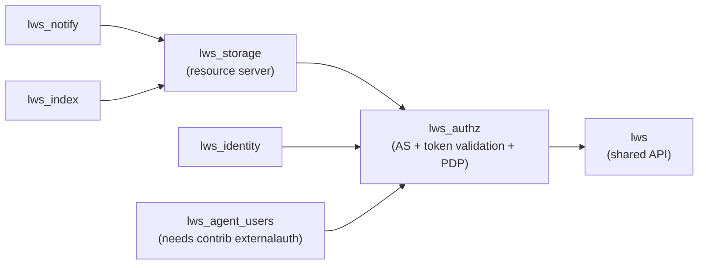
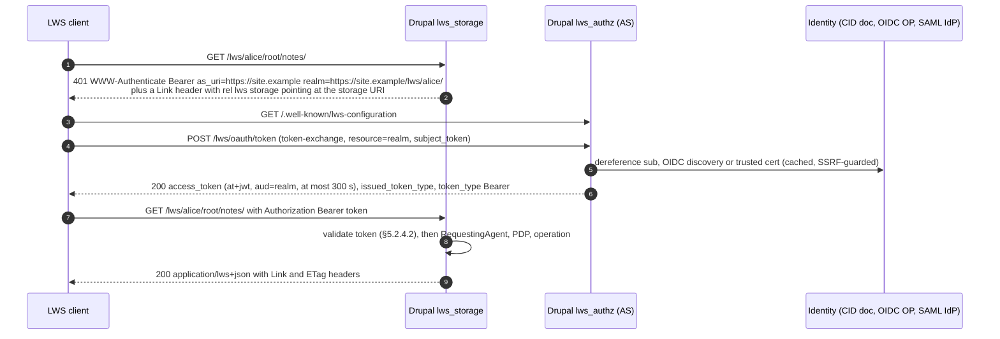

# Drupal LWS: design

Drupal 11 modules that make a Drupal site a **W3C Linked Web Storage (LWS) 1.0** server: a storage
(resource) server, an OAuth 2.0 authorization server for it, and the optional services the LWS
specifications define around them.

| | |
|---|---|
| **Status** | Draft for review. Nothing is implemented yet |
| **Date** | 2026-10-07 |
| **Spec baseline** | LWS Core **W3C Working Draft, 5 October 2026** ([`WD-lws10-core-20261005`](https://www.w3.org/TR/2026/WD-lws10-core-20261005/)), the text of `w3c/lws-protocol` @ `ef02548` ("Switch baseline PATCH format from JSON Merge Patch to JSON Patch", #255). The companion drafts as they stood at that commit; see [§2](#2-specification-baseline) |
| **Target platform** | Drupal `^11.3` (PHP 8.3+, Symfony 7). Avoids APIs deprecated for Drupal 12 |
| **How to review** | Decisions that need your sign-off are tagged **[D1]…[D15]** and gathered in [§13](#13-decisions-for-review). Open questions are in [§14](#14-open-questions) |

---

## Contents

1. [Goals and non-goals](#1-goals-and-non-goals)
2. [Specification baseline](#2-specification-baseline)
3. [Architecture](#3-architecture)
4. [URL space](#4-url-space)
5. [Storage module: `lws_storage`](#5-storage-module-lws_storage)
6. [Authorization module: `lws_authz`](#6-authorization-module-lws_authz)
7. [Optional modules](#7-optional-modules)
8. [Cross-cutting concerns](#8-cross-cutting-concerns)
9. [Libraries and the PHP LWS client](#9-libraries-and-the-php-lws-client)
10. [Implementation plan](#10-implementation-plan)
11. [Testing and conformance](#11-testing-and-conformance)
12. [Spec interpretation decisions](#12-spec-interpretation-decisions)
13. [Decisions for review](#13-decisions-for-review)
14. [Open questions](#14-open-questions)
15. [Appendix A: Core MUST checklist](#appendix-a-core-must-checklist)

---

## 1. Goals and non-goals

### Goals

- **Conformance.** A Drupal site running these modules is an *LWS Server* as defined by LWS Core
  §2.3, and passes the Touchstone conformance harness for every area it advertises.
- **A complete stack in one site.** The site can host many storages, issue access tokens for them
  through RFC 8693 token exchange, validate the three authentication suites, and enforce access
  policy. Each part can also be deployed alone:
  - storage only, trusting an external authorization server;
  - authorization server only, issuing tokens for remote storages.
- **Idiomatic Drupal.** The modules use entities (resource content is stored as managed `file`
  entities), services, plugins, config, Views, Drush, the
  queue and the authentication-provider system. Site builders get an admin UI, and other modules
  get events and hooks to extend.
- **Interoperability.** The server works with `ebremer/lws-client` (all languages), the Java
  `lws-server` authorization server, and the Keycloak `lws-authn` OpenID provider.

### Non-goals for 1.0

These may become later steps; see [§14](#14-open-questions).

- Projecting existing Drupal content (nodes, media, users) as LWS resources. The design leaves a
  seam for it in [§7.4](#74-lws_projection-optional-later).
- RDF processing: Turtle content negotiation, SPARQL Update `PATCH`, JSON-LD expansion.
- DPoP (RFC 9449), WebDAV, resumable uploads, Solid/WAC compatibility.
- Moving resources (proposed upstream in #237).
- Storages on their own hostnames, one per storage.

---

## 2. Specification baseline

| Document | Version used | Module |
|---|---|---|
| [lws10-core](https://www.w3.org/TR/2026/WD-lws10-core-20261005/) | **WD 2026-10-05** | `lws_storage`, `lws_authz` |
| [lws10-authn-ssi-cid](https://www.w3.org/TR/lws10-authn-ssi-cid/) | WD 2026-09-21 (covers `did:key` and `did:web` subjects) | `lws_authz` |
| [lws10-authn-openid](https://www.w3.org/TR/lws10-authn-openid/) | WD 2026-08-03 | `lws_authz` |
| [lws10-authn-saml](https://www.w3.org/TR/lws10-authn-saml/) | WD 2026-08-03 | `lws_authz` (later step) |
| lws10-authn-ssi-did-key | Discontinued 2026-09-18; subsumed by SSI-CID | not implemented on its own |
| [lws10-notifications-webhook](https://w3c.github.io/lws-protocol/lws10-notifications-webhook/) | ED @ `ef02548` | `lws_notify` |
| [lws10-index](https://w3c.github.io/lws-protocol/lws10-index/) | ED @ `ef02548` | `lws_index` |
| [lws10-vocab](https://w3c.github.io/lws-protocol/lws10-vocab/) | `vocabulary.yml` @ `ef02548` (includes `StorageResource`) | `lws` |

Section numbers below (§5.2.1 and so on) are those of the core Working Draft.

The **5 October change that matters here** is #255: JSON Patch (RFC 6902,
`application/json-patch+json`) is now the baseline `PATCH` format for resources and linksets. JSON
Merge Patch is an optional extra.

---

## 3. Architecture

### 3.1 Modules

The repository is one Drupal project, `lws`, with submodules:

```
lws/                              ← this repository (composer type: drupal-module)
├── lws.info.yml                  "Linked Web Storage" — shared API, no UI
├── src/                          Drupal\lws\…
├── modules/
│   ├── lws_authz/                "LWS Authorization" — authorization server, token validation, policy
│   ├── lws_storage/              "LWS Storage" — the storage (resource) server
│   ├── lws_notify/               "LWS Notifications" — §10 + webhook suite          (optional)
│   ├── lws_index/                "LWS Type Index" — lws10-index                     (optional)
│   ├── lws_identity/             "LWS Identity" — Drupal users as LWS agents        (optional)
│   └── lws_agent_users/          "LWS Agent Users" — LWS agents as Drupal users     (optional add-on)
├── tests/                        cross-module e2e (PHP LWS client) and Touchstone config
└── DESIGN.md
```



**[D1] Module split.**

- **`lws`** holds no entities and no routes. It provides:
  - the protocol primitives: vocabulary, media types, headers, problem details, preconditions,
    JSON Patch and pagination cursors;
  - the URL-space path processor;
  - the *seams* both halves meet at:
    - `RequestingAgent`, the agent value object;
    - `AccessDecisionInterface`, the policy decision point (PDP);
    - `StorageRegistryInterface`;
    - the `lws.storage_service` tag that storage services register under.
- **`lws_authz`** is everything about *who* and *may they*:
  - the embedded authorization server;
  - the Drupal authentication provider that validates access tokens at the storage;
  - the policy model and its evaluation;
  - the access request and access grant services (§11).

  It depends only on `lws`, so it can run as a standalone AS for remote storages.
- **`lws_storage`** is everything about *resources*: storages, containers, data resources,
  linksets, the storage description and the operations of §9. It asks `lws_authz` who the caller
  is and whether the operation is allowed.

Putting the PDP and §11 in `lws_authz` keeps "what is allowed" in one module. Grants are a protocol
front end over the policy store, not a storage feature.

### 3.2 The seams

```php
namespace Drupal\lws\Agent;

/** Who is making a request, as established by a validated access token. */
final class RequestingAgent {
  public function __construct(
    public readonly ?string $subject,   // agent URI (token `sub`); NULL = unauthenticated
    public readonly ?string $client,    // token `client_id`
    public readonly ?string $issuer,    // token `iss`
    public readonly ?string $tokenId,   // token `jti`, for audit only
  ) {}
  public function isAuthenticated(): bool { return $this->subject !== NULL; }
}

namespace Drupal\lws\Access;

interface AccessDecisionInterface {
  /** Decides one operation on one resource. Never throws for "deny". */
  public function decide(RequestingAgent $agent, Action $action, ResourceContext $resource): Decision;

  /** A decider bound to one agent, for evaluating many resources (container listings). */
  public function forAgent(RequestingAgent $agent, StorageRef $storage): AgentAccessScope;
}
```

`ResourceContext` is a plain value object: storage URI, resource URI, ancestor container URIs,
kind, media type and declared types. The PDP therefore never loads storage entities.
`Action` is an enum of the four §11.3.2 actions plus `Control`, which covers managing grants.

### 3.3 Request flow



---

## 4. URL space

### 4.1 Layout

**[D2]** Each storage gets a URI of its own, which is also its `realm` and the `aud` of its tokens.
Its root container sits one level below it. System services live beside the root container, never
inside it.

| URL (default `/lws` prefix, configurable) | Resource | Provided by |
|---|---|---|
| `https://site.example/.well-known/lws-configuration` | AS metadata (RFC 8414) | `lws_authz` |
| `https://site.example/lws/oauth/token` | Token endpoint (RFC 8693) | `lws_authz` |
| `https://site.example/lws/oauth/jwks` | AS public keys | `lws_authz` |
| `https://site.example/lws/{s}/` | **Storage URI** (`id`, `realm`, `aud`); serves the storage description | `lws_storage` |
| `https://site.example/lws/{s}/root/` | Storage root container | `lws_storage` |
| `https://site.example/lws/{s}/root/…` | Containers (`…/`) and data resources | `lws_storage` |
| `https://site.example/lws/{s}/meta/{uuid}` | Linkset resource of the resource `{uuid}` | `lws_storage` |
| `https://site.example/lws/{s}/access/requests/[{id}]` | `AccessRequestService` | `lws_authz` |
| `https://site.example/lws/{s}/access/grants/[{id}]` | `AccessGrantService` | `lws_authz` |
| `https://site.example/lws/{s}/notifications/[{id}]` | `NotificationService` (webhook) | `lws_notify` |
| `https://site.example/lws/{s}/types/index`, `…/types/search` | `TypeIndexService`, `TypeSearchService` | `lws_index` |
| `https://site.example/lws/agents/{uuid}` | An agent's controlled identifier document | `lws_identity` |

Why this layout:

- **It matches the spec's own example.** The storage `https://storage.example/` has its root at
  `https://storage.example/root/`.
- **It matches the PHP client's interop layout.** Its mock server and `InteropTest` use
  `{base}/` and `{base}/root/`, so the client's tests run against Drupal unchanged.
- **The realm logically contains everything at a `/` boundary.** The client checks containment
  that way, and a single token covers resources, linksets, grants and subscriptions.
- **There are no name collisions.** Users can never create `meta`, `access` or `notifications`
  inside the root, because those names do not live in the root.
- **The storage URI needs no content negotiation trick.** The alternative, which `lws-server`
  chose, is to make the storage URI and the root container the same URI and switch on `Accept`.

Storage slugs match `[a-z0-9][a-z0-9-]{0,62}`. The canonical scheme, host and prefix come from
config (`lws.settings:base_url`), never from the request's `Host` header. See
[§8.4](#84-security).

### 4.2 Routing variable-depth paths in Drupal

Drupal's router cannot match a parameter that spans `/`. `RouteProvider` splits the path into
segments and matches *pattern outlines*. It also right-trims `/` from the path before inbound path
processors see it, and again before matching. LWS needs arbitrary depth, and it needs the trailing
slash, because `…/notes` and `…/notes/` are different resources.

The skeleton (Step 0) implements this. Five pieces work together, all driven by one parser,
`LwsUrlParser`. It reads the **raw** path from `$request->getPathInfo()`, which is not URL-decoded,
keeps its case and keeps its trailing slash. It returns an `LwsTarget`: the storage slug, the area
(`description`, `resource`, `meta`, `unknown` or `malformed`) and the decoded segment names.

1. **`LwsPathProcessor`**, an inbound path processor at priority 1100, runs above core's
   `path_processor_decode` (1000), so its `$path` argument still matches the raw path. It works
   like core's `PathProcessorFiles` for `/system/files/…`, mapping every URL under the prefix to a
   fixed internal path per area: `/_lws/description`, `/_lws/resource`, `/_lws/meta`,
   `/_lws/unknown`. It does **not** pass the target along on the request. The router caches the
   processed path per URL and skips path processors on a cache hit, so anything a processor
   stores on the request is gone from the second request on.
2. **`LwsRouteEnhancer`** parses the URL again after routing; enhancers run on every request. It
   hands the controller an `$lws_target` argument. When an internal path is requested directly, the
   URL doesn't parse to that route's area, and the answer is `404`.
3. **`LwsRequestSubscriber`** (`kernel.request`, priority 1010) answers two kinds of request before
   core does:
   - **Malformed paths get `400`.** Core's `RedirectLeadingSlashesSubscriber` (priority 1000)
     redirects any path containing `//` to the path with the slashes collapsed. In LWS that is a
     different resource.
   - **`OPTIONS` gets `204` with the target's `Allow`, unauthenticated.** Core's
     `OptionsRequestSubscriber` (priority 1000) answers *every* `OPTIONS` request itself with the
     union of the methods of all routes on the path. Declaring an `OPTIONS` route does not stop it.
4. **`LwsExceptionSubscriber`** (`kernel.exception`, priority 250) renders every error under the
   prefix as RFC 9457 problem details. It runs ahead of core's `Fast404ExceptionHtmlSubscriber`
   (priority 200), which would otherwise answer a `404` for a name such as `notes.txt` with an HTML
   page. It also runs ahead of the exception logger (50), so `4xx` protocol traffic is not logged
   as site errors; `5xx` is logged to the `lws` channel.
5. **`DisallowLwsRequests`**, a page-cache request policy, keeps everything under the prefix, and
   any request carrying `Authorization: Bearer` or `DPoP`, out of the page cache.

Internal routes match on method. Every LWS route carries:

- `_auth: ['lws_bearer']`. Cookie authentication is never used on LWS routes; see
  [§8.4](#84-security);
- `no_cache: TRUE`;
- `_access: 'TRUE'` for now. Step A1 replaces it with `_lws_access`, the access check in
  [§5.4](#54-request-pipeline).

Checked against Drupal 11.4.8 by kernel tests, and by curl through Apache with the page cache
enabled.

Outbound, `LwsUrlGenerator` builds absolute canonical URIs from entities. LWS code never uses
`Url::fromRoute()` for protocol URIs.

---

## 5. Storage module: `lws_storage`

### 5.1 Entities

**`lws_storage`** is a content entity, not config. Storages are created at runtime, per user or
per project, and must not be exported with site config.

| Field | Type | Notes |
|---|---|---|
| `id`, `uuid` | | |
| `slug` | string, unique, binary collation | URI segment |
| `label` | string | |
| `controllers` | string (URI), multiple | *Storage controllers* (agents) with full control |
| `owner` | entity ref → `user`, optional | Drupal user who administers it in the UI |
| `authorization_server` | string | `local`, or the id of an `lws_trusted_as` config entity; supplies `as_uri` |
| `quota_bytes`, `used_bytes` | integer | `507` when exceeded |
| `settings` | map | Page size, `require_if_match`, `conceal_existence`, … (defaults come from `lws_storage.settings`) |
| `status`, `created`, `changed` | | A blocked storage answers `503` |

The root container is not a field: it is the storage's resource with no parent, created in the
same transaction as the storage. S1 implements `slug`, `label`, `controllers`, `owner`, `status`,
`created` and `changed`, and A1 adds `authorization_server` (empty for the site's default, which is
`lws_authz.settings:authorization_server`); the other fields arrive with the steps that use them
(S2, S3).

**`lws_resource`** is a content entity, not revisionable in 1.0, and has no bundles.

| Field | Type | Notes |
|---|---|---|
| `id`, `uuid` | | The `uuid` names the linkset (`…/meta/{uuid}`) and appears in the content file's URI |
| `storage` | entity ref | |
| `parent` | entity ref → `lws_resource` | `NULL` only for the root |
| `name` | string, **binary** collation | Last path segment; containers end in `/`. Unique per `(parent, name)` |
| `path` | string(2048), binary | Materialized path relative to the storage URI, e.g. `root/notes/a.txt`. Used for URL lookup (through `path_hash`) and subtree queries (prefix) |
| `path_hash` | char(64) | SHA-256 of `path`. Unique per `(storage, path_hash)`, because MySQL cannot index the whole of a 2048-character `utf8mb4` column |
| `kind` | `container` \| `data` | |
| `content` | core `file` field → `file` entity | Data resources only: the current version of the content ([§5.3](#53-content-as-managed-files)). The File entity holds the `uri`, `filename` (the resource name), `filemime` (the media type; default `application/octet-stream`), `filesize` and `uid`, so those are not duplicated here |
| `content_sha256` | char(43) | base64url. Feeds the ETag, and later `Repr-Digest` |
| `version` | integer | Bumped on every change. For containers this includes membership changes and changes to members' listed metadata |
| `types` | string (URI), multiple | User-declared `rel="type"` values (for listings, the `type` constraint and the type index) |
| `links` | JSON (big text) | User-managed linkset relations, minus the server-managed ones |
| `links_version` | integer | Feeds the linkset ETag |
| `created`, `changed`, `meta_changed` | timestamp | `changed` feeds `Last-Modified` and `modified` in listings |
| `creator`, `creator_client` | string (URI) | Audit only. Never used for access decisions |

S1 implements `storage`, `parent`, `name`, `path`, `path_hash`, `kind`, `version`, `created` and
`changed`. The content fields and `creator` arrive with S2, and `types` and the `links` fields with
S4. A container's `version` is incremented with an SQL expression (`version + 1`) inside the
transaction that changes its membership, so concurrent creates in one container are all counted.

A custom `SqlContentEntityStorageSchema` adds the unique and prefix indexes. Name and path columns
use `'binary' => TRUE`, so on MySQL they get `utf8mb4_bin`: LWS URIs are case-sensitive, and the
default collation is not.

`content` uses core's `file` field type rather than a plain entity reference. Core then tracks file
usage whenever a resource is saved or deleted, and Views can relate resources to their files.

### 5.2 Operations

Every write is one database transaction. The table maps each operation to its HTTP behaviour.

| Operation | Behaviour (spec §) |
|---|---|
| **Storage description** `GET/HEAD {s}/` | CID document ([§5.5](#55-storage-description)). `application/lws+cid` by default; `application/ld+json` and `application/json` by negotiation; otherwise `406`. `Vary: Accept`. Readable by anyone. `Link: <{s}/>; rel="…lws#storage"` (§6.1) |
| **Read data resource** `GET/HEAD` | The stored bytes with the stored `Content-Type`. Headers: `ETag` (strong), `Last-Modified`, `Accept-Ranges: bytes`, single-range `206`/`416` (§9.3, RFC 7233), `Allow`, `Accept-Patch` (JSON resources), and `Link` for `linkset` (`type="application/linkset+json"`), `up`, `type` (`lws#DataResource` plus user types) and `lws#storage` (§9.1, §9.3). Served with Symfony `BinaryFileResponse` for local stream wrappers, and a ranged `StreamedResponse` otherwise |
| **Read container** `GET/HEAD` | Container representation (§8.1) with items `{id, type, format, size, modified}`; `format` is always present on data resources. `application/lws+json`, `application/ld+json` and `application/json` are equivalent: `Content-Type` echoes the request and `Vary: Accept` is sent (§12.1.1). Anything else is `406`. Paginated: see [§5.6](#56-container-listings-and-pagination) |
| **Conditional read** | `If-None-Match` / `If-Modified-Since` → `304`; `If-Range` (§9.3; RFC 9110 §13) |
| **Create** `POST` to a container | Creates a container when `Link: <https://www.w3.org/ns/lws#Container>; rel="type"` is present (body ignored), otherwise a data resource from the body and `Content-Type`. The name comes from the `Slug` hint, sanitised to `[A-Za-z0-9._~-]` and made unique (`a.txt` → `a-1.txt`), or else from a generated id. A name never starts with `.`: Drupal's `.htaccess` refuses such path segments with `403`. Other `Link` headers become user-managed metadata (`rel="type"` → `types`); server-managed relations in them are ignored (§9.2). Response: `201`, absolute `Location`, `Link` for `up`, `linkset` and `type`, and `ETag`. Missing target → `404`; target is not a container → `405`. Quota → `507`; rejected by a Drupal file validator → `422` |
| **Replace** `PUT` | Data resources only. Replaces bytes and media type. Missing resource → `404` (§9.4: there is no PUT-to-create); container → `405`. `204` on success. With `Prefer: set-linkset` and `Link` headers, also replaces the user-managed links atomically and answers `Preference-Applied: set-linkset` |
| **Patch** `PATCH` | `application/json-patch+json` (RFC 6902) on JSON resources (`application/json` and `*/*+json`). Optional `application/merge-patch+json`. Non-JSON resource or other patch format → `415` with `Accept-Patch`. Malformed patch → `400`; failed `test` or missing path → `409`; result not valid JSON for the media type → `422`. `Prefer: set-linkset` works as for `PUT` |
| **Delete** `DELETE` | `204`. Removes the resource, its linkset and its parent's membership atomically (§9.5). A non-empty container without `Depth: infinity` → `409`; any other `Depth` value → `400`. Recursive delete is allowed only if the agent may delete *every* descendant, otherwise `403` and nothing is removed. The root cannot be deleted (`405`) |
| **Write preconditions** | `If-Match`, `If-None-Match`, `If-Unmodified-Since` → `412`, evaluated in RFC 9110 §13.2.2 order *inside* the transaction against a row locked with `SELECT … FOR UPDATE`, after its container's (every write locks down the tree, and the storage's quota row last). Optional per-storage `require_if_match` → `428` (off by default; see [§12](#12-spec-interpretation-decisions)) |
| **Linkset** `GET/HEAD meta/{uuid}` | `application/linkset+json`, `{"linkset":[{"anchor":"<resource URI>", …}]}`. Includes the server-managed `up` and `type` and the user relations. `ETag`; `Allow: GET, HEAD, PUT, PATCH, OPTIONS`; `Accept-Patch: application/json-patch+json, application/merge-patch+json` (§9.1) |
| **Linkset** `PATCH` / `PUT` | A JSON Patch applies to the **document a GET returns** (`/linkset/0/license`), not to the storage form. The result must still be a linkset for the same anchor (`422` otherwise). Changes to server-managed relations (`up`, `linkset`, `lws#storage`, the LWS class `type`s) → `409`. `412` on a failed precondition (§9.4). The linkset is deleted with its resource |
| **`OPTIONS`** | `204` with `Allow` and `Accept-Patch` for that resource kind. Unauthenticated, as CORS preflight requires, so it is answered from the shape of the URL alone: it never reveals whether a resource exists |
| **Errors** | `application/problem+json` (RFC 9457) everywhere |

ETags are opaque and strong:

| Resource | ETag value | Why |
|---|---|---|
| Data resource | `base64url(sha256(content_sha256 ‖ filemime))[0..22]` | Identical bytes give an identical tag, so an idempotent `PUT` keeps it. Changing the type changes it |
| Container | `"c{version}"`; a page adds the cursor (`"c{version}.{cursor-hash}"`) | Stable between a `GET` and a later `DELETE … If-Match`, which Touchstone relies on |
| Linkset | Hash of the canonical document | |

### 5.3 Content as managed files

**[D11]** Each version of a data resource's content is a permanent, managed `file` entity,
referenced from the resource's `content` field. The bytes live at
`{scheme}://lws/{storage-uuid}/{aa}/{bb}/{resource-uuid}.{random}`. The random suffix, rather
than the version, means two concurrent writes to one resource never share a file. The scheme
defaults to `private`; any stream wrapper works, for example S3 through `s3fs` or Flysystem.

- **Writing.** The request body (`php://input`) is streamed straight to the new URI and hashed as
  it goes. Core's `file.repository` `writeData()` is not used, because it holds the whole body in
  memory. Then, in one transaction:
  1. a permanent File entity is created for the new URI, with `filename` = the resource name and
     `filemime` = the request `Content-Type`; core fills in `filesize`;
  2. the resource's `content` field is pointed at the new file, and the resource is saved. Core's
     file field adds a usage of the new file by the resource and removes the usage of the old one.
- **Readers never see a half-written resource**, because only the field reference moves, and it
  moves inside the transaction.
- **Superseded versions.** After commit, a post-commit callback
  (`TransactionManagerInterface::addPostTransactionCallback()`) deletes the previous File entity,
  which also deletes its bytes, **if it has no usage left**. If something else still uses it, for
  example a Media item an administrator made from it, the file is kept. The resource simply no
  longer points at it.
- **Rollback.** If the transaction fails, the new File entity disappears with it, and a `catch`
  block deletes the new bytes.
- **Never temporary.** Files are created permanent, so core's cron never purges them as temporary
  files.
- **Validation.** Before the transaction, the new File entity goes through core's file validation
  service (`file.validator`). Validators that other modules attach there, such as virus scanning,
  therefore apply to LWS uploads. A rejection → `422`.
- **Paths never come from client input.** File URIs are made of UUIDs, so path traversal through
  resource names is impossible by construction.
- **Clean-up is guaranteed.** A queue worker, `lws_storage_gc`, sweeps two cases:
  - File entities under the LWS directory with no usage;
  - bytes with no File entity, left by a crash between writing and committing.

  Recursive deletes queue their files rather than deleting them inside the request.
- **Size limits come from several places.** Request size is limited by quota and by
  `lws_storage.settings:max_upload_bytes`. The deployment must also allow it: PHP's
  `post_max_size` still applies to `POST`, and so do web-server body limits. `hook_requirements()`
  reports any mismatch.

**Direct downloads are refused.** Core serves private files at `/system/files/…`. The file
module's own `hook_file_download()` implementation grants access through any entity that references
the file, which would let Drupal entity access override LWS policy. To keep LWS policy
authoritative, `lws_storage` implements `hook_file_download()`:

- It returns `-1` for every URI under the LWS directory unless the user has
  `administer lws storages`. A `-1` from any module wins over every grant.
- Core checks image-style derivatives of private images through the same hook, so they are covered
  too.

LWS clients always read content through its LWS URL.

**Containment integrity (§7.3)** comes from four mechanisms:

- a resource and its parent's `version` are written in the same transaction;
- `(parent, name)` is unique, so a concurrent create that loses retries with the next suffix;
- the parent must be a container, so no orphans can exist;
- there is no move operation, and names cannot contain `/`, so no cycles can form.

### 5.4 Request pipeline

1. **Page cache.** The `lws.page_cache_request_policy` service denies caching for anything under
   the LWS prefix, and for any request with `Authorization: Bearer`. It works like `basic_auth`'s
   `DisallowBasicAuthRequests`. Without it, core's page cache would treat a bearer request as
   anonymous: it could serve a cached public response, or cache a private one.
2. **Authentication** (priority 300). The `lws_bearer` provider from `lws_authz` *applies* to
   every request under the LWS prefix, with or without a token, and to nothing else. Claiming the
   whole URL space keeps every other provider out of it: a session cookie never authenticates an
   LWS request, and outside the prefix `Bearer` is left to `simple_oauth`. The provider never
   throws. It looks the storage up through `StorageRegistryInterface`, validates any token against
   the storage's authorization server and URI, and puts an `Authentication` (agent, RFC 6750 error,
   realm, `as_uri`) in the request attribute `_lws_auth`. A valid token also makes the current user
   an `LwsAccount`. A failed validation is acted on by the access check, after routing.
3. **Path processing.** `LwsPathProcessor` maps the URL to an internal route path, and
   `LwsRouteEnhancer` gives the controller `$lws_target`
   ([§4.2](#42-routing-variable-depth-paths-in-drupal)). Malformed paths and `OPTIONS` were already
   answered by `LwsRequestSubscriber`.
4. **Parameter conversion.** `LwsRouteEnhancer` runs ahead of core's parameter conversion and
   supplies the storage slug. The `lws_storage` converter loads the storage: `404` if there is
   none, `503` if it is blocked. The resource itself is looked up through `ResourceRepository`, by
   the controller and, from A1, by the access check. For `POST` the target must be a container.
5. **Access** (`_lws_access`).
   1. A token that was present but invalid → `401` with `error="invalid_token"`, even on public
      resources (§5.2.4.2).
   2. Map the method to an `Action` (§11.3.2):

      | Method | Action |
      |---|---|
      | GET, HEAD, OPTIONS | `read` (`OPTIONS` is exempt) |
      | POST | `create`, checked on the target container |
      | PUT, PATCH | `modify` |
      | DELETE | `delete` |

      A linkset inherits its resource's decision: read for `GET`, modify for writes.
   3. Ask the PDP.
   4. If it denies:
      - no token → `401` challenge;
      - authenticated → `403`;
      - but `404` instead if the storage sets `conceal_existence` and the agent cannot read the
        parent (§9.5 allows it).
6. **Controller.** Evaluate preconditions, run the operation in a transaction, and build the
   response with `LwsResponseBuilder`. The builder sends:
   - `Link` (`lws#storage` on every `GET` and `HEAD`), `ETag`, `Last-Modified`, `Allow`,
     `Accept-Patch` and `Vary`;
   - `Cache-Control: private` unless the resource is publicly readable;
   - for data resources, `X-Content-Type-Options: nosniff` and `Content-Security-Policy: sandbox`
     (see [§8.4](#84-security)).
7. **Exception subscriber** (LWS paths only). Renders problem details. A `401` adds
   `WWW-Authenticate: Bearer as_uri="…", realm="{s}/"[, error="…"]` and
   `Link: <{s}/>; rel="…lws#storage"` (§5.2.1, §9.2). A `405` adds `Allow`; a `415` adds
   `Accept-Patch`.
8. **After commit.** The storage dispatches `LwsResourceEvent` (`created`, `updated`,
   `metadata_updated`, `deleted`) once the transaction has committed: right after the
   operation, or at the end of the request when an outer transaction committed it, never from
   the commit itself (S6). `lws_notify` and `lws_index` listen; nothing else depends on it.

### 5.5 Storage description

`StorageDescriptionBuilder` assembles the CID document from services tagged `lws.storage_service`.
Each tagged service contributes a `service` entry, and optionally `capability` entries and
`verificationMethod` entries.

```json
{
  "@context": ["https://www.w3.org/ns/cid/v1", "https://www.w3.org/ns/lws/v1"],
  "id": "https://site.example/lws/alice/",
  "type": "Storage",
  "capability": [{
    "type": "https://www.w3.org/ns/lws#PatchSupport",
    "format": {
      "application/json": ["application/json-patch+json", "application/merge-patch+json"],
      "application/linkset+json": ["application/json-patch+json", "application/merge-patch+json"]
    }
  }],
  "service": [
    {"type": "StorageRoot", "serviceEndpoint": "https://site.example/lws/alice/root/"},
    {"type": "AccessRequestService", "serviceEndpoint": "https://site.example/lws/alice/access/requests/",
     "conformsTo": ["https://www.w3.org/ns/lws#AccessProfile"]},
    {"type": "AccessGrantService", "serviceEndpoint": "https://site.example/lws/alice/access/grants/",
     "conformsTo": ["https://www.w3.org/ns/lws#AccessProfile"]}
  ]
}
```

**[D3]** The core draft's capability example uses a placeholder IRI
(`https://feature.example/PatchSupport`). This design uses the same IRI as `lws-server`,
`https://www.w3.org/ns/lws#PatchSupport`, so the two servers advertise patch support identically.
That term is **not** defined in `lws10-vocab` yet, and it changes if the working group mints a
different one. Clients must not depend on it; `Accept-Patch` is the normative signal.

### 5.6 Container listings and pagination

- **Order and cursors.** Items are ordered by `name` under binary collation. Pagination uses
  keyset cursors, so it stays stable while the container changes. A cursor is an opaque string,
  `?page=<base64url(iv ‖ tag ‖ ciphertext)>`: the name it starts after, encrypted with AES-256-GCM
  under a key derived from the site's private key, with the container's UUID as associated data.
  Nobody can read it, as a filtered page may end on a member the agent cannot see (S5). The IV is
  a MAC of the container and the name, so one position always makes one cursor.
  - `first` (the container URI) is always present, and `next` is present when more items exist
    (§12.1.2).
  - `prev` and `last` are sent when the listing is a plain query (step 3 below); `last` starts at
    the multiple of the page size that following `next` from the first page reaches.
  - A tampered cursor, or one signed for another container (such as one deleted and created again
    at the same URI) → `404`. A cursor whose member has since been deleted still works: the page
    starts after where that name would be.
  - The first page's entity tag is the container's (`"c{version}"`); other pages add a hash of the
    cursor.
- **Page size.** Set per storage (`page_size`); the default is `lws_storage.settings:page_size`,
  100. Touchstone's multi-page tests need a page size below 5 on the test storage.
- **Authorization filtering (§7.5).** Listings come from `AccessDecisionInterface::forAgent()`.
  1. The PDP pre-computes the agent's applicable policies once per request.
  2. It answers per item in memory.
  3. When the agent may read the whole container subtree and no constraint narrows it, the
     listing is a plain SQL page (resources joined to `file_managed` for `format` and `size`),
     and `totalItems` is a `COUNT(*)`.
  4. Otherwise the server scans in keyset order until a page is filled, or until it has examined
     `$settings['lws_storage_scan_limit']` members (1,000), or one page's worth if that is more;
     a page that stops early links `next` from the last member examined.
  5. `totalItems` counts the visible members among the first `lws_storage_scan_limit`, so it is
     exact for most containers and never more than the truth, which §8.1.1 allows. An estimate
     would tell how many members the agent cannot see.
  6. A filtered page's entity tag is a hash of what it shows (`"f…"`), and it has no
     `Last-Modified`: both would otherwise change with members the agent cannot see. Every
     listing sends `Vary: Accept, Authorization`.

### 5.7 Admin UI, permissions, Drush

- **Admin UI:**
  - `/admin/config/services/lws`: settings for the base URL, prefix and stream wrapper;
  - `/admin/content/lws`: storages (a View) and a read-only resource browser. The browser is a
    View over `lws_resource` with a relationship to each resource's file, so it shows the file
    name, MIME type, size and owner. Download links use core's private-file route, which the
    download hook ([§5.3](#53-content-as-managed-files)) limits to `administer lws storages`. The
    browser calls services directly, not HTTP, so it needs no token;
  - a "Create media item" action **copies** the file into the site's default file scheme and
    creates a Media item from the copy. Publishing to the site is then an explicit editorial act:
    later LWS policy changes do not affect it, and it does not affect LWS;
  - uploads through the UI are deferred; clients do that.
- **Permissions:**

  | Permission | Allows |
  |---|---|
  | `administer lws` | Site settings |
  | `administer lws storages` | All storages |
  | `create lws storage` | Creating a storage |
  | `manage own lws storages` | Storages whose `owner` is the user |
- **Drush:**
  - `lws:storage:create <slug> --controller=<agent-uri>…`
  - `lws:storage:list`
  - `lws:storage:delete`
  - `lws:gc`

---

## 6. Authorization module: `lws_authz`

`lws_authz` has three parts, each usable alone:

1. **Token validation at the storage** (§5.2.4). Validates access tokens from the local AS or any
   trusted external AS.
2. **The embedded authorization server** (§5.2.2–§5.2.3). Provides metadata, JWKS and token
   exchange, with the authentication suites as plugins.
3. **Policy.** Provides the PDP, the policy store, the access request and access grant services
   (§11), and the UI.

### 6.1 Token validation at the storage (§5.2.4)

`AccessTokenValidator` performs these checks, rejecting on any failure:

1. **Structure.** The token is a compact JWS. The header has `typ` = `at+jwt` or
   `application/at+jwt` (RFC 9068 §4) and
   `alg` from an allow-list (ES256, ES384, EdDSA; RS256 and PS256 once `lws-client` verifies RSA,
   by A5). `none` and `HS*` are never accepted, and neither is a `crit` header.
2. **Issuer.** `iss` must be the storage's configured AS: `local`, or a `lws_trusted_as` config
   entity.
3. **Signature.** Verified with a key from that AS's `jwks_uri`. The metadata document is fetched
   from `/.well-known/lws-configuration`, with RFC 8414 path insertion if the issuer has a path.
   Pinned JWKS are also supported, for air-gapped setups and for Touchstone's
   `HarnessIssuedTokens`.
   - Keys are cached in a `cache.lws` bin.
   - An unknown `kid` triggers one refetch, rate-limited by flood control (key rotation, as
     §5.2.4.2 requires).
4. **Audience.** `aud` must have **exactly one** value, equal to the storage URI that contains the
   target (§5.2.4.2).
5. **Time.** `exp` must be in the future; `nbf`, if present, must have passed; `iat` must not be in
   the future. Clock skew allowed: 60 s, configurable.
6. **Required claims.** `sub` (a URI), `client_id` (a URI) and `jti` must be present (§5.2.3.2).

The result is a `RequestingAgent(sub, client_id, iss, jti)`. Failures map to `error="invalid_token"`
(bad signature, expired, wrong audience) or `invalid_request` (malformed), with an
`error_description` that leaks nothing.

**Agent ↔ Drupal user ([D4]).** By default, LWS agents are *not* Drupal users. The `LwsAccount`
is an anonymous Drupal session (uid `0`, role `anonymous`) that carries the `RequestingAgent`.
Drupal permissions play no part in LWS decisions; only the PDP does.

The optional add-on `lws_agent_users`
([§7.5](#75-lws_agent_users-lws-agents-as-drupal-users-optional-add-on)) maps agents to Drupal user
accounts through the contrib `externalauth` module. When it is enabled, the provider puts the
mapped user (uid and roles) on the `LwsAccount`. Either way:

- LWS routes are not reachable with cookies;
- the provider applies to no other route;
- so a bearer token can never act as a Drupal user outside LWS.

### 6.2 Authorization server metadata (§5.2.2)

The issuer is the site origin by default (`https://site.example`), with no path. This makes the
metadata URL exactly `/.well-known/lws-configuration`, as §5.2.2 states. A site installed in a
sub-directory needs a web-server rewrite; `hook_requirements()` checks for this.

```json
{
  "issuer": "https://site.example",
  "token_endpoint": "https://site.example/lws/oauth/token",
  "jwks_uri": "https://site.example/lws/oauth/jwks",
  "grant_types_supported": ["urn:ietf:params:oauth:grant-type:token-exchange"],
  "response_types_supported": ["token"],
  "token_endpoint_auth_methods_supported": ["none"],
  "claims_supported": ["sub", "iss", "client_id", "aud", "exp", "iat", "jti"],
  "subject_token_types_supported": [
    "urn:ietf:params:oauth:token-type:jwt",
    "urn:ietf:params:oauth:token-type:id_token",
    "urn:ietf:params:oauth:token-type:saml2"
  ],
  "subject_identifier_types_supported": ["https", "did:key", "did:web"]
}
```

`subject_token_types_supported` lists only the suites that are enabled. For
`subject_identifier_types_supported`, the values follow the spec's example and default (`"https"`,
not `"https:"`). The metadata is also served at `/.well-known/oauth-authorization-server`, for
generic OAuth clients.

### 6.3 Token exchange (§5.2.3)

`POST /lws/oauth/token` takes `application/x-www-form-urlencoded`, with no client authentication
(public clients; the client is identified by the credential). It runs these steps, stopping at the
first error:

1. Check that `grant_type` is `urn:ietf:params:oauth:grant-type:token-exchange`. Otherwise →
   `unsupported_grant_type`.
2. Check that `resource`, `subject_token` and `subject_token_type` are present (`resource` is
   required by §5.2.3.1; the other two by RFC 8693). Otherwise → `invalid_request`.
3. Check that `resource` is a known storage URI, local or configured remote, and is trusted
   (§5.2.3.1). Otherwise → `invalid_target`.
4. Select the authentication suite plugin by `subject_token_type`. A disabled or unknown type →
   `invalid_request`.
5. The suite validates the credential ([§6.4](#64-authentication-suites)) and returns a
   `ValidatedCredential(subject, issuer, client, audience, expiresAt)`. Failure →
   `invalid_request` (RFC 8693 §2.2.2).
6. Check that the audience contains this AS's issuer, if the suite requires it (SSI-CID: always;
   OpenID: by default, per trusted issuer). See [§12](#12-spec-interpretation-decisions).
7. Mint an RFC 9068 access token:
   - header `typ: at+jwt`, `alg: ES256` and `kid`;
   - claims `iss`, `sub` and `client_id`;
   - `aud` = `resource`, a single string;
   - `iat`, and a UUIDv4 `jti`;
   - `exp` = now + `min(300 s, credential exp − now)`.
8. Respond `200` with `{access_token, issued_token_type:
   "urn:ietf:params:oauth:token-type:access_token", token_type: "Bearer", expires_in}`, plus
   `Cache-Control: no-store`. Errors are RFC 6749 §5.2 JSON, also `no-store`.

**Abuse controls.** Requests are rate-limited per IP and per subject through Drupal's flood
service. Request size is capped. `subject_token` is never logged; failures log only a hash prefix
of the token (Privacy Considerations).

**Signing keys.**

- **Storage.** ES256 (P-256). The private keys are PEM files under a directory set in
  `settings.php` (`$settings['lws_authz_key_directory']`), outside the web root and the database.
  The Key module can supply them instead, if it is installed.
- **Key ids.** `kid` is the RFC 7638 thumbprint.
- **Rotation.** `drush lws:key:rotate` adds a key and makes it active. The JWKS keeps publishing
  retired keys for at least the maximum token lifetime plus clock skew.

### 6.4 Authentication suites

A plugin type, `LwsAuthenticationSuite`, uses a PHP attribute. A suite is one class:

```php
#[LwsAuthenticationSuite(
  id: 'ssi_cid',
  label: new TranslatableMarkup('Self-signed controlled identifier'),
  token_type: 'urn:ietf:params:oauth:token-type:jwt',
)]
final class SsiCidSuite extends AuthenticationSuiteBase {
  public function validate(string $subjectToken, TokenExchangeContext $context): ValidatedCredential;
}
```

| Suite | Token type | Validation |
|---|---|---|
| **SSI-CID** (first) | `…:token-type:jwt` | `alg` must not be `none`. `sub` = `iss` = `client_id`. `aud` includes this AS. `exp` and `iat` required. `kid` selects a verification method of the subject's controlled identifier document, through its `authentication` relationship (CID 1.0 §3.3); it must be controlled by the subject, and be `JsonWebKey` or `Multikey`. Signature per RFC 7515 §5.2. Subjects: `https:` (dereferenced; `id` must equal `sub`), `did:key` (resolved locally) and `did:web` (over HTTPS) |
| **OpenID Connect** | `…:token-type:id_token` | `alg` must not be `none`. Identifiers: `sub` → subject, `iss` → issuer, `azp` → client. Trust is pre-configured per issuer (`lws_trusted_issuer`) **or** discovered: dereference `sub` as a CID document, require a `service` with `type` `https://www.w3.org/ns/lws#OpenIdProvider` and `serviceEndpoint` equal to `iss`, then run OIDC discovery to get `jwks_uri`. Then OIDC Core §3.1.3.7 validation |
| **SAML 2.0** (later, a module of its own) | `…:token-type:saml2` | Trust is out-of-band only (`lws_trusted_issuer` with IdP certificates). Exactly one assertion, with one enveloped signature over it (defends against signature wrapping). `NameID` → subject, `Issuer` → issuer, `SubjectConfirmationData/@Recipient` → client, `Audience` must include this AS. `NotBefore`/`NotOnOrAfter` checked |

**Outbound fetches** (CID documents, OIDC discovery, JWKS) go through `lws.outbound_http`. It is
Drupal's Guzzle client with an SSRF guard:

- HTTPS only, except for a dev allow-list;
- private, loopback and link-local addresses refused after DNS resolution;
- cURL pinned to the checked addresses (`CURLOPT_RESOLVE`), on a fresh connection that is never
  reused, so neither DNS rebinding nor a kept-alive connection can bypass the check;
- at most 3 redirects, followed by hand and each re-checked;
- 256 KiB body cap and 5 s timeout.

Callers cache what they fetch: discovered keys for an hour, failures for a minute.

**Config entities:**

- `lws_trusted_issuer`: an OpenID Provider (issuer URL, optional pinned JWKS,
  `require_as_audience`, `verify_subject`). The SAML module will bring its own, for entity IDs
  and certificates;
- `lws_trusted_as`: an external authorization server for a storage (issuer, optional pinned JWKS).

Being config, both deploy across environments.

### 6.5 Policy model and the PDP

The core defines no ACL language for storages. The only policy vocabulary it defines is the
**access profile** of §11.3, which is ODRL-based. **[D5]** The PDP uses that profile as *its own*
policy model, so an access grant (§11) maps 1:1 to stored policy, with no translation layer.

**`lws_policy`** is a content entity, one row per `AccessPolicy` object.

| Field | Notes |
|---|---|
| `storage` | |
| `source` | `controller` (a storage controller, implicit), `admin` (created in the Drupal UI) or `grant:{id}` (created by an access grant; deleted with it) |
| `actions` | Subset of `read`, `modify`, `create`, `delete` |
| `assignee` | Agent URI, or `http://xmlns.com/foaf/0.1/Agent` for the public. Optionally `http://www.w3.org/ns/auth/acl#AuthenticatedAgent` (extension, [§12](#12-spec-interpretation-decisions)). With `lws_agent_users`, also a Drupal role, as `https://site.example/lws/roles/{role}` ([§7.5](#75-lws_agent_users-lws-agents-as-drupal-users-optional-add-on)) |
| `target_type` | `lws#StorageResource`, `lws#Container` or `lws#DataResource` |
| `target_values` | Resource URIs, multiple, required ([§12](#12-spec-interpretation-decisions)) |
| `constraints` | JSON list of `{leftOperand, operator, rightOperand}` |
| `not_after` | Derived from `dateTime` `lteq`/`lt`. Lets cron purge expired policies; evaluation never relies on it. A big integer: it may lie past 2038 |

**Evaluation** (`PolicyEvaluator::decide`):

```
decide(agent, action, resource):
  user = mappedUser(agent)                                -- NULL unless lws_agent_users is enabled
  if user and user.isBlocked():                           → DENY     (agent kill switch)
  if agent.subject ∈ storage.controllers:                 → PERMIT   (storage controller)
  if user and user.hasPermission('bypass lws access policy'): → PERMIT
  assignees = {agent.subject, foaf:Agent}
              ∪ {acl:AuthenticatedAgent if agent.isAuthenticated()}
              ∪ roleUris(user)                            -- empty without lws_agent_users
  for each policy p in storage where action ∈ p.actions and p.assignee ∈ assignees:
    if not targetMatches(p, resource): continue
    if all constraints hold for (agent, resource, now):   → PERMIT
  → DENY

targetMatches(p, resource):
  kindOk = p.target_type is StorageResource
           or (Container    and resource.kind == container)
           or (DataResource and resource.kind == data)
  scope  = { resource.uri } ∪ resource.ancestorUris        -- recursive over containment [D6]
  return kindOk and (p.target_values ∩ scope ≠ ∅)
```

`create` is evaluated against the **target container**, and `kindOk` uses the container. The type
and format of the resource being created are checked against the request's `Link` and
`Content-Type` headers.

**Constraints** (§11.3.5). All of them must hold. Every left operand must be supported, and
unknown operands or operators fail closed.

| `leftOperand` | Value compared | Operators |
|---|---|---|
| `client` | Token `client_id` | `eq`, `neq`, `isAnyOf`, `isNoneOf` |
| `format` | Resource media type; for `create`, the request `Content-Type` | `eq`, `neq`, `isAnyOf`, `isNoneOf` |
| `type` | The resource's types: the LWS class plus user `rel="type"` | `eq` (contains), `isAnyOf`, `isAllOf`, `isNoneOf` |
| `dateTime` | Request time, compared with an `xsd:dateTime` | `eq`, `lt`, `lteq`, `gt`, `gteq` |
| `purpose` | **No request-time source in the core** → fail closed, unless a site configures a source, such as a token claim | `eq`, `isAnyOf` [D7] |

**Performance.** `forAgent()` loads the agent's candidate policies for a storage once per request,
indexed by target URI. Each `decide()` is then a lookup of the resource URI and its ancestors (at
most `depth + 1` hash lookups) plus the constraint checks. Nothing is cached across requests, so
revocation takes effect immediately.

**Drupal UI.** A storage's `owner` (a Drupal user) and administrators manage policies
under `/admin/content/lws/{storage}/access`:

- a "Share" form (agent URI, actions, target, expiry);
- a list of active grants and pending access requests, with Approve and Deny buttons. Approve
  creates an access grant.

### 6.6 Access requests and grants (§11)

The two services are LWS containers, rendered with the same container and pagination code as
storage listings.

| Endpoint | Who | Behaviour |
|---|---|---|
| `POST access/requests/` | Any authenticated agent | Validates `application/lws+json`: the `@context` includes `https://www.w3.org/ns/lws/v1`; `type` ∋ `AccessRequest`; `storage` = this storage; `access` is a non-empty list of valid `AccessPolicy` objects; `assignee` = the requesting agent (Security §16.3). `201` + `Location`. Rate-limited and size-capped |
| `GET access/requests/[{id}]` | Controllers; the requester for their own | Listing or document (Privacy §17.1) |
| `DELETE access/requests/{id}` | Requester or controller | Cancels the request |
| `POST access/grants/` | **Storage controllers only** (`Control`) | Validates the same way (`type` ∋ `AccessGrant`). Creates one `lws_policy` per `access` entry in the same transaction. `201` + `Location` |
| `GET access/grants/[{id}]` | Controllers; assignees for their own. A client-constrained grant is hidden from other clients (Privacy §17.1) | Listing or document |
| `DELETE access/grants/{id}` | Controllers | Revokes the grant: deletes it and its policies atomically. Takes effect on the next request |

Stored documents gain an `id`. Notifications (§11.6, SHOULD) are sent when `lws_notify` is
enabled (S6):

- a `Create` activity for a new access request or grant, and a `Delete` when one is cancelled,
  answered or revoked, delivered to the `inbox` it names;
- a grant made by approving a request is also announced to the request's inbox, in the same
  notification as the request's `Delete`.

Controllers learn of new requests on the access page: topics are resources of the storage, so no
subscription covers the requests service.

The section is marked "needs to align" in the core, so the payload is the core notification data
model.

---

## 7. Optional modules

These come after the two core modules ([§10](#10-implementation-plan), steps S6–S8, I1 and U1). They
are described briefly here; each gets its own design note when it starts.

### 7.1 `lws_notify`: notifications (§10) and the webhook suite

- **Discovery.** `NotificationService` at `{s}/notifications/`, with `subscriptionType:
  ["WebhookSubscription"]`.
- **Subscriptions.** `POST` (`application/lws+json`: `type`, `topic[]`, `inbox`, `expires`) → `201`
  with `Location` and `{type, subscription, expires}`.
  - The subscriber must be able to read every topic (§10.3.3), through its client.
  - Topics are resources of the storage; the storage URI stands for its root container.
  - A subscription is stored as an `lws_subscription` entity, with the subscriber's agent and
    client.
  - `GET` lists the caller's live subscriptions as an LWS container; `GET`/`DELETE` act on one,
    for its agent or a controller.
- **Delivery.**
  1. `LwsResourceEvent`s become `Create`, `Update` or `Delete` activities (§10.2.3).
  2. Each subscription that covers the resource is checked against the PDP **when the change is
     made**, for the subscriber's agent and client (§10.3.3). A queued retry checks again.
  3. A request's activities are batched, one notification per subscription or inbox, and
     delivered after the response is sent. Later retries, and what does not fit the time budget,
     go through the Queue API, on cron.
  4. The `POST` to the inbox carries `Content-Digest: sha-256` (RFC 9530) and an RFC 9421
     signature over `@method @scheme @authority @path content-type content-digest`, with
     `created`, `keyid = {s}#{kid}` and `alg`.
  5. `5xx`, `429` and no answer are retried with backoff; other answers fail at once. Repeated
     failure deactivates the subscription, and `410 Gone` does at once.
- **Signing key.** The site's P-256 key, kept like the authorization server's, published in every
  storage description as a `verificationMethod` (`JsonWebKey`) referenced from `authentication`.
- **Privacy.** `actor` is omitted unless configured (Privacy §17.2). The SSRF guard applies to
  inbox URLs, when subscribing and at every delivery.

### 7.2 `lws_index`: type index and type search

- **`GET types/index`** returns a paginated `TypeIndex` of the distinct types of the resources the
  agent can read.
- **`QUERY types/search`** (RFC 10008) takes `application/lws-query+json`, a conjunctive normal
  form over `type` and the descriptive relations the site lets searches filter on, and answers a
  paginated `ContainerPage`. Errors are `400`, `415` (with `Accept-Query`), `406`, `422` and, for
  a page link that is not one, `404`. `OPTIONS` returns `Allow: GET, HEAD, QUERY, OPTIONS` and
  `Accept-Query`; `GET` serves only the pages of results.
- **Storage.** A derived table, `lws_index_link(resource_id, storage_id, rel, href, hash)`, kept
  by entity hooks in the transaction that changes the resource. The index spec allows it to lag;
  this one does not. Results are always filtered live through `forAgent()`, and narrowed to where
  the agent may read anything (`readableTargets()`).
- **Risk checked first.** `QUERY` survives Apache, Symfony 7.4 (which counts it as safe) and
  Drupal's method matching.

### 7.3 `lws_identity`: Drupal users as LWS agents

This makes Drupal a *complete* LWS stack, as the Keycloak `lws-authn` extension does for Keycloak.

- **Agent URI.** Every Drupal user can have one: `https://site.example/lws/agents/{uuid}`. It serves
  a CID 1.0 controlled identifier document (JSON-LD).
- **OpenID.** If an OpenID provider runs on the site (for example `simple_oauth` with OpenID
  Connect), the document lists it as a `…lws#OpenIdProvider` service.
- **Self-signed keys.** Users can register public keys as `authentication` verification methods,
  for SSI-CID.
- **Provisioning.** Optionally, a storage is created for each new user, with that user's agent URI
  as controller. With `lws_agent_users` enabled, that URI is also linked to the user in the
  authmap, so tokens for it act as that user.

### 7.4 `lws_projection` (optional, later)

Exposes selected Drupal entity bundles as **read-only** LWS containers, so that nodes, media and
taxonomy appear as data resources (JSON from the serializer). It would be implemented as an
alternative `ResourceBackend` behind the parameter converter. It is out of scope for 1.0; see
question Q1.

### 7.5 `lws_agent_users`: LWS agents as Drupal users (optional add-on)

**[D15]** This add-on maps external LWS agents to Drupal user accounts, through the authmap of the
contrib `externalauth` module. It is off by default, and nothing in the core modules depends on it.
It is the inverse of `lws_identity`, which gives Drupal users agent URIs.

- **Mapping.** After a token validates, the provider looks up the authmap (provider `lws`) for the
  token's `sub`.
  - The authmap's `authname` column holds 128 characters, and agent URIs can be longer. The
    authname is therefore `sha256:` plus the hex digest of the agent URI, and the full URI is kept
    in a user field, `lws_agent_uri`.
  - The authmap's primary key is (uid, provider), so each Drupal user maps to at most one agent.
    That fits provisioned accounts. A local user with several agent identities picks one; this is
    a known limitation.
- **Provisioning modes** (config):

  | Mode | Behaviour |
  |---|---|
  | `link_only` (default) | Only agents linked to an account map to a user. An administrator links them on the user edit form, or `lws_identity` links local users automatically. Every other agent stays uid `0` |
  | `provision` | The first valid token from an agent creates an account through `externalauth`: no password, no email, a username derived from the hash, and default roles from config. Can be limited to listed issuers or subject patterns |

- **What it enables:**
  - *Roles as policy assignees.* A policy's `assignee` can be
    `https://site.example/lws/roles/{role}`, and the PDP matches it when the mapped user has that
    role. Sharing with "Editors" then follows Drupal role membership.
  - *A kill switch.* Blocking the user in Drupal denies that agent everywhere (`403`), without
    touching any grant.
  - *A bypass permission.* `bypass lws access policy` gives storage-controller rights on every
    storage, for support staff. Like `bypass node access`, it is marked restricted.
  - *Attribution.* File entities (`uid`) and the audit log carry the user, so Drupal's user and file
    admin screens show who wrote what. Hooks and ECA models can react to LWS events with a real
    user.
  - *Groups, later.* The same pattern extends to Group module memberships as assignees
    (`…/lws/groups/{id}`).
- **Guardrails:**
  - The mapped user is set only on LWS routes (`_auth` is unchanged). A token never yields a
    Drupal session and never reaches another route.
  - Drupal permissions never grant LWS access, except through the restricted bypass permission and
    role assignees in explicit policies.
  - Provisioned accounts cannot log in interactively.
  - Role URIs are identifiers only. Dereferencing one gives `404`, so membership is not disclosed.
  - **Privacy.** Accounts store an agent URI and a last-seen time. With pairwise (pseudonymous)
    subject identifiers, each pseudonym becomes its own account. A cron job cancels provisioned
    accounts unseen for a configurable period, using the "reassign content to Anonymous" method.

---

## 8. Cross-cutting concerns

### 8.1 Headers

`LwsResponseBuilder` is the only place that builds `Link` headers. It uses the PHP client's
`LinkHeader` formatter. Every `GET` and `HEAD` response on a Storage Resource carries:

| Header | When |
|---|---|
| `Link … rel="https://www.w3.org/ns/lws#storage"` | Always (§6.1.2), including linksets, service containers and the description itself |
| `Link … rel="up"` | Any non-root resource (§7.2) |
| `Link … rel="linkset"; type="application/linkset+json"` | Any resource |
| `Link … rel="type"` | The LWS class, plus each user type |
| `ETag` | Always (§9.1, §9.3) |

### 8.2 CORS

Browser clients need CORS on every LWS route, the token endpoint and the metadata. `lws` handles
CORS for its own paths with a response subscriber and the `OPTIONS` routes:

- methods: `GET, HEAD, POST, PUT, PATCH, DELETE, OPTIONS, QUERY`;
- allowed headers include `Authorization`, `Content-Type`, `If-Match`, `If-None-Match`,
  `If-Modified-Since`, `If-Unmodified-Since`, `Link`, `Slug`, `Prefer`, `Depth`, `Range`;
- exposed headers: `Link`, `Location`, `ETag`, `Last-Modified`, `WWW-Authenticate`, `Allow`,
  `Accept-Patch`, `Accept-Query`, `Content-Range`, `Preference-Applied`, `Vary`;
- no credentials (cookies are never used).

Core's site-wide `cors.config` can stay off.

### 8.3 Caching

- **Drupal caches.** The page cache is bypassed as in [§5.4](#54-request-pipeline). Responses are
  plain Symfony responses, not `CacheableResponseInterface`, so the dynamic page cache ignores
  them.
- **HTTP caches.** A public resource gets `Cache-Control: public, no-cache` with validators.
  Everything else gets `private`. `Vary: Accept, Authorization, Origin` where relevant.
- **Every LWS response sets `Cache-Control` explicitly.** For a plain response whose
  `Cache-Control` is Symfony's default (`no-cache, private`), core's `FinishResponseSubscriber`
  removes `ETag`, `Last-Modified` and `Vary`, and LWS requires ETags. Symfony sorts directives, so
  `private, no-cache` counts as the default too; the skeleton uses
  `private, no-cache, max-age=0`.
- **Internal caches.** JWKS, AS metadata, CID documents and OIDC discovery are cached in the
  `cache.lws` bin.

### 8.4 Security

| Threat | Mitigation |
|---|---|
| **Stored XSS from user content served on the Drupal origin.** An uploaded HTML or SVG file opened in a browser would run with access to admin sessions | Data resources are always sent with `Content-Security-Policy: sandbox` and `X-Content-Type-Options: nosniff`. **[D8]** We recommend serving LWS from a **separate, cookie-less hostname** (`storage.site.example`) that maps to the same Drupal: set `lws.settings:base_url` and allow the host in `trusted_host_patterns`. `hook_requirements()` warns when LWS shares the admin origin |
| CSRF through cookies | LWS routes accept no cookie authentication (`_auth: ['lws_bearer']` only), and bearer tokens are not ambient |
| Host-header injection into `realm`/`aud`/`Location` | Canonical URIs come from config only. The `trusted_host_patterns` setting is required |
| Token theft and replay | Tokens last ≤300 s and are bound to one audience. Tokens are never logged (hash prefixes only). `Cache-Control: no-store` on token responses. DPoP is a later step ([§14](#14-open-questions)) |
| JOSE pitfalls | `alg` allow-list per key type. `none` and `HS*` are rejected. The key type must match `alg`. `typ` is checked. The `kid` must belong to the expected issuer or subject |
| SSRF through `sub`, `iss`, `jwks_uri` and inbox URLs | `lws.outbound_http` guard ([§6.4](#64-authentication-suites)) |
| Resource exhaustion | Quotas (`507`), upload caps, recursive-delete limit (`lws_storage.settings:max_recursive_delete`; above it → `422` with a problem detail), page-size cap, flood control on the token endpoint, access-request service and subscriptions. Since S5: bodies are refused by their `Content-Length` before they are read (`413`, or `507` when the quota cannot hold them), small bodies (linksets, patches, access documents) are read no further than their limit, a recursive delete counts before it loads or locks anything, a filtered listing examines a bounded number of members, a patch has at most 1,000 operations and 32 `copy`s, and a patched document may not grow past its limit, user types are at most 32 URIs of at most 2,048 bytes, and paths at most 2,048 characters |
| Bypassing LWS policy through core's private-file route (`/system/files/…`) or image styles | `hook_file_download()` returns `-1` for every LWS file to users without `administer lws storages` ([§5.3](#53-content-as-managed-files)). Administrators get it as an attachment, with `CSP: sandbox` (S5) |
| Information disclosure | Listings filtered per agent (§7.5). Optional `404` concealment. Problem details never echo token contents. Grants and requests visible only to the parties involved (§17.1) |
| Path traversal and name tricks | Content file URIs are made of UUIDs. Names are segment-validated: no `/`, `.` or `..`, no control characters, case-sensitive. Names made from `Slug` are ASCII (`[A-Za-z0-9._~-]`), so there is nothing to normalise; only `createContainer()` (Drush, tests) takes others, as given. A name and its twin with or without the slash (`notes`, `notes/`) are never both taken, and policy targets match exactly. Paths are at most 2,048 characters (`400` beyond) |

### 8.5 Logging and audit

Every write logs to the `lws` logger channel: storage, resource UUID, action, agent, client, `jti`
and outcome. It never logs credentials or content. Access-grant creation and revocation also go to
watchdog at `notice` level.

---

## 9. Libraries and the PHP LWS client

**[D9]** Reuse `ebremer/lws-client` at **runtime**, for protocol primitives only, behind thin
adapters in `lws`. It has no Composer runtime dependencies (ext-curl, json, openssl and sodium
only), and these parts work without its HTTP layer:

| Client class (`Ebremer\Lws\…`) | Used by the server for |
|---|---|
| `Vocabulary`, `MediaType`, `LinkRelation`, `ResourceType`, `ServiceType`, `TokenType`, `Prefer`, `AccessAction`, `ActivityType`, `ConstraintOperand`, `ConstraintOperator` | Constants, so client and server cannot disagree on an IRI |
| `Http\LinkHeader`, `Http\Link`, `Http\WwwAuthenticate`, `Http\Slug`, `Http\StructuredFields` | Formatting outgoing `Link`/`WWW-Authenticate`; parsing incoming `Link`/`Slug`/`Prefer`; `Signature-Input`/`Content-Digest` for webhooks |
| `Json\JsonPatch`, `Json\JsonPointer` | Parsing and validating incoming patches. **The client has no applier**; see below |
| `Auth\Jwt`, `Auth\SigningKey`, `Auth\VerificationKey` | Minting ES256 `at+jwt`, building the JWKS, verifying ES256/ES384/EdDSA signatures. The server adds all claim validation |
| `Auth\DidKey`, `Auth\ControlledIdentifierDocument`, `Model\VerificationMethod` | `did:key` resolution and CID documents (SSI-CID, `lws_identity`) |
| `Model\StorageDescription`, `ContainerPage`, `Linkset`, `Access\*` | **Tests**: parsing the server's own output (round-trip conformance) |
| `Notification\WebhookVerifier` | **Tests**: verifying our webhook signatures. Its `signatureBase()` is shared with the signer |
| `Notification\WebhookSigner` | Signing webhook deliveries (`lws_notify`) |

**Gaps to close upstream in `lws-client`.** Each would help clients as well.

1. **`JsonPatch::apply()`.** An RFC 6902 applier: atomic, with `test` semantics. *Written with S4,*
   with a new cross-language fixture, `conformance/fixtures/json-patch-apply.json` (RFC 6902
   Appendix A and edge cases), rather than the community suite.
2. **RSA verification (RS256, PS256) in `VerificationKey`.** Most OpenID providers sign with RS256
   by default, Keycloak included. Today the client verifies only ES256, ES384 and EdDSA.
3. **A `WebhookSigner`**, the counterpart of `WebhookVerifier`. *Written with S6,* and tested
   against the conformance vectors: the Ed25519 one comes out byte for byte.
4. **Publish to Packagist.** A drupal.org release can only depend on packages there. Until then,
   the site's `composer.json` uses a VCS repository.

If you'd rather not couple the server to the client ([§14](#14-open-questions), Q4), the fallback is
`web-token/jwt-library` for JOSE and an in-house JSON Patch applier. The adapters in `lws` make
either swap local.

**Other libraries:**

- `robrichards/xmlseclibs`, for SAML XML-DSig, used with strict structural checks. Needed in step
  A5 only.
- Drupal's own Guzzle client.
- Contrib `externalauth`, for the `lws_agent_users` add-on only.
- No RDF library in 1.0.

---

## 10. Implementation plan

The work is split into steps per module, and the steps interleave. Each step ends in a reviewable
merge with passing tests; the build order is at the end of this section.

### Step 0: Foundation (`lws`)

- **Scope:**
  - `composer.json`, info files, the `lws.settings` config schema and settings form;
  - coding standards (`phpcs` with Drupal and DrupalPractice), `phpstan` (level 8,
    `phpstan-drupal`), and the DDEV setup (PHP 8.3, MariaDB and PostgreSQL, HTTPS);
  - CI on GitHub Actions, with an SQLite and MySQL matrix.
- **Code:**
  - the seams ([§3.2](#32-the-seams)) and `LwsPathProcessor` with `LwsTarget`;
  - `LwsUrlGenerator`, `ProblemResponse`, `Preconditions` (RFC 9110 §13.2.2), `PaginationCursor`;
  - the `lws.outbound_http` SSRF guard;
  - the CORS subscriber and the page-cache request policy;
  - the adapters over `ebremer/lws-client`.
- **Exit:** unit tests for the path parser (trailing slashes, percent-encoding, case),
  preconditions (the RFC 9110 matrix), cursors and the SSRF guard (DNS-rebinding cases).

**Done in the walking skeleton:**

- `composer.json` and the info file; the `lws.settings` schema (base URL and prefix), but no
  settings form yet;
- phpcs (Drupal and DrupalPractice), phpstan level 8, and a DDEV config for `ddev-drupal-contrib`;
- CI on GitHub Actions: PHP 8.3 and 8.4, latest Drupal 11, SQLite;
- the URL space ([§4.2](#42-routing-variable-depth-paths-in-drupal)): `LwsUrlParser`,
  `LwsPathProcessor`, `LwsRouteEnhancer`, `LwsRequestSubscriber`, `LwsExceptionSubscriber`;
- `LwsUrlGenerator`, `ProblemResponse`, `LwsResponse`, `LinkHeader`;
- the page-cache request policy;
- placeholder responses (`UrlSpaceController`), which S1 replaces.

Since then, S1 added the settings form and `hook_requirements()`, A1 the seams, the SSRF guard
and the CORS subscriber, S2 `Preconditions`, and S3 `PaginationCursor`. Q4 was decided for using `lws-client` directly,
with no adapters.

**Still to do in Step 0:**

- the MySQL and PostgreSQL CI matrix.

### Storage module steps

**S1. Storages, the URL space and the storage description.**

- **Scope:**
  - the `lws_storage` and `lws_resource` entities, the storage schema and indexes;
  - creating a storage with its root;
  - internal routes and the `lws_target` parameter converter;
  - `GET`/`HEAD` of the storage description (CID, content negotiation, `lws#storage` link);
  - `GET`/`HEAD` of an empty root container;
  - `drush lws:storage:create`;
  - the `lws.storage_service` tag.
- **Auth:** none yet. Kernel and functional tests inject a `RequestingAgent` through a test-only
  authentication provider.
- **Spec:** §6.1, §7.1, §7.2, §8.1.
- **Exit:** functional tests show that the description validates through
  `Model\StorageDescription::parse()` and that the root listing validates through
  `ContainerPage::parse()`.

**Done.** Differences from the plan above:

- **More was built:**
  - content negotiation for descriptions and containers, with the requested profile echoed;
  - container listings with members (no pagination yet; that is S3);
  - `lws:storage:list` and `lws:storage:delete`;
  - the settings form, and status-report checks for the base URL, a shared host and the private
    file system;
  - blocked storages answering `503`.
- **Built differently:**
  - the root is the resource with no parent, not a `root` field;
  - storages are converted by a route parameter converter, and resources are looked up by the
    controller;
  - kernel tests drive requests through the HTTP kernel; there is no test-only authentication
    provider yet, because nothing checks access before A1.
- **lws-client (Q4: reuse):** the server uses its `MediaType`, `LinkRelation`, `ResourceType`,
  `ServiceType`, `Vocabulary` and `Http\LinkHeader`, replacing the module's own constants and
  formatter. Tests parse the server's responses with its `StorageDescription` and `ContainerPage`.
- **Verified:** 123 tests; and through Apache with Drush, curl and the PHP LWS client itself
  (`discoverStorage`, `getStorageDescription`, `readContainer`, `listContainer`).
- **Requirement raised to Drupal 11.3**, for `#[Hook('runtime_requirements')]` and the
  `RequirementSeverity` enum.

**S2. Data resources and containers (create, read, replace, delete).**

- **Scope:**
  - `POST` to create data resources and containers (`Slug`, initial `Link` metadata), returning
    `201`, `Location` and the link headers;
  - `GET`/`HEAD` with ranges;
  - `PUT` replace, and `DELETE` (including `Depth: infinity` and `409`);
  - content as managed files ([§5.3](#53-content-as-managed-files)): the atomic reference swap,
    usage-aware clean-up, `file.validator`, `hook_file_download()` and the garbage-collection
    queue;
  - ETags, `Last-Modified`, and conditional requests (`304`, `412`, `428` option);
  - quotas (`507`), problem details, and `OPTIONS` with `Allow`.
- **Spec:** §7.3, §9.2, §9.3, §9.4 (PUT), §9.5, §9.6.
- **Exit:** kernel tests on containment integrity under concurrent creates (two processes, same
  `Slug`); functional tests for every status code in [§5.2](#52-operations); the PHP client's
  `quickstart.php`, with auth disabled, runs green.

**Done.** Differences from the plan above:

- **More was built:**
  - a read-only linkset at `meta/{uuid}` with the server-managed `up` and `type`, because every
    create, read and listing must link one (§9.1); S4 makes it writable;
  - the `lws:gc` Drush command, which sweeps unused file entities and bytes left without one
    (older than an hour, so a write in progress is never touched);
  - `drush lws:storage:create --quota`, and used and quota bytes in `lws:storage:list`.
- **Built differently:**
  - methods a URL's shape does not allow (`PUT` on a container, `POST` on a data resource,
    `DELETE` on the root) are refused with `405` before authentication, like `OPTIONS`;
  - file URIs take a random suffix instead of the version (see [§5.3](#53-content-as-managed-files));
  - core always runs its insecure-upload check, which refuses names such as `app.js`. Content is
    validated under its stored UUID name, so that check does not apply to LWS names;
  - data resources are served with exactly their stored media type: Symfony's `prepare()` and
    PHP's `default_charset` would add `charset=UTF-8` to any `text/*` type. `BinaryFileResponse`
    also left the file's length on a `416`, which is fixed;
  - `require_if_match` is a site-wide setting for now; per-storage settings come with S5;
  - a create locks the parent first, so a create racing a recursive delete of its container
    gets `404` instead of leaving an orphan.
- **Left for later:** user `Link` metadata on create and `Prefer: set-linkset` (S4); a
  `StreamedResponse` for remote stream wrappers, which may not seek (S5); the request-size check
  against `post_max_size` in the status report (S5).
- **Exit criteria:**
  - concurrent creates: a kernel test forces the lost race (a hook takes the name between the
    check and the insert) and the create retries with the next name. Through Apache, 20
    simultaneous `POST`s with the same `Slug` all got `201` with 20 distinct names, and the
    container's version rose by exactly 20;
  - every status in [§5.2](#52-operations) that S2 covers has a kernel test: `201`, `204`, `206`,
    `304`, `400`, `401`, `403`, `404`, `405`, `409`, `412`, `413`, `415`, `416`, `422`, `428`,
    `507`;
  - `quickstart.php`, with a bearer token in place of token exchange (A2) and without `PATCH`
    (S4), runs green.
- **Touchstone,** with harness-issued tokens (see A1): containers 18/18, conditional requests
  9/9, discovery 7/7, storage authorization 17/17, data resources 16/17 (the failure is `PATCH`,
  S4), linksets 6/9 (writes, S4). Its authorization-server tests ran against the trusted
  `lws-server`, which refuses to issue tokens for other storages (A2 brings Drupal's own).
  Pagination, access grants and notifications were inapplicable.
- **Verified:** 258 tests; and through Apache with curl, the PHP LWS client and Touchstone.

**S3. Container listings, content negotiation and pagination.**

- **Scope:**
  - the container representation;
  - the equivalence of `lws+json`, `ld+json` and `json`, with `Vary`;
  - keyset pagination (`first`, `next`, `prev`);
  - the `forAgent()` filtering hook, using a stub PDP until A3;
  - `totalItems`.
- **Spec:** §7.5, §8.1, §12.1.
- **Exit:** with a page size of 5, the client's `listContainer()` walks 8 items across 2 pages;
  stale cursors give `404`.

**Done.** Differences from the plan above:

- **Built as planned:** keyset pages with `first`, `next`, `prev` and `last`; `totalItems` across
  pages; `AccessDecisionInterface::forAgent()` with `AgentAccessScopeInterface`, whose
  `readsSubtree()` lets a listing be a plain query, and `mayRead()` filters member by member
  otherwise. Until A3 only controllers read listings, so the filtered path is exercised by a test
  policy.
- **Built differently:** cursors are signed rather than versioned, so a listing that changes
  between pages keeps working; only a forged or foreign cursor is "stale" (`404`). The filtered
  path counts the visible members by scanning, and offers only `next`; the threshold for an
  approximate count waits until listings that large are filtered (A3).
- **Exit criteria:** with a page size of 5, the PHP client's `listContainer()` walked 8 members
  across 2 pages through Apache. Stale and forged cursors give `404` (kernel tests).
- **Touchstone:** pagination 4/4 with a page size of 2 (the single-page test is then
  inapplicable) and the single-page test with the default size; 83 passed in `core` overall, the
  failures being `PATCH`, linkset writes (S4) and the authorization server (A2).
- **Verified:** 267 tests.

**S4. Metadata: linksets, link headers and JSON Patch.**

- **Scope:**
  - linkset `GET`, `HEAD`, `PUT` and `PATCH` (JSON Patch on the GET document, protection of
    server-managed relations, `422`);
  - user types in `Link` headers;
  - `Prefer: set-linkset` on `PUT` and `PATCH`;
  - `PATCH` on JSON data resources (JSON Patch, plus merge patch as an option);
  - `Accept-Patch` and the `PatchSupport` capability;
  - the upstream `JsonPatch::apply()`.
- **Spec:** §9.1, §9.2 (initial metadata), §9.4.
- **Exit:** the JSON Patch fixture suite passes. Linkset round-trips go through
  `Model\Linkset::parse()`.

**Done.** Differences from the plan above:

- **Built as planned:**
  - linksets take `PUT` (`application/linkset+json`) and `PATCH` (JSON Patch on the document a
    `GET` returns), conditionally (`412`); the result must be a linkset of the resource (`422`),
    and server-managed relations (`up`, `linkset`, `lws#storage`, the pagination relations, LWS
    classes among the types) cannot change (`409`). A `PUT` may leave them out;
  - user types and other relations from a create's `Link` headers, with target attributes as
    RFC 9264 §4.2.4 says; server-managed relations and links with an `anchor` are ignored;
  - `Prefer: set-linkset` on `PUT` (replace) and `PATCH` (add), atomic with the content, answered
    with `Preference-Applied`;
  - `PATCH` on JSON resources (`application/json` and `+json`): applied to the content as it is
    once the resource is locked, all or nothing; a failed `test` or a missing location is `409`,
    content that is not JSON `422`, another patch format `415` with `Accept-Patch`;
  - `Accept-Patch` on JSON resources and linksets, and the `PatchSupport` capability;
  - user types in `Link` headers and in listings (`"type": ["DataResource", "…"]`).
- **Left out:** JSON Merge Patch (optional), and `Prefer: PreferLinkRelations` on linkset reads,
  which the plan allowed to slip.
- **Built differently:** the linkset entity tag is a digest of the document alone, the same for
  `application/linkset+json` and `application/json`, so conditional writes work whichever was read.
  There is no `links_version`.
- **Exit criteria:** the client's apply fixture (50 cases) passes in `lws-client` and again through
  HTTP `PATCH` against Drupal. Linkset round trips are parsed with `Model\Linkset::parse()`.
- **Touchstone:** data resources 17/17 and linksets 8/8 (the ninth applies only to servers without
  linkset `PUT`); `core` has 83 passed, the only failures being the authorization server's (A2).
  `quickstart.php`, with a bearer token in place of token exchange, runs green with its `PATCH`.
- **`lws-client` must be released first:** the module now needs `JsonPatch::apply()`, so CI, which
  installs `lws-client` `dev-main` from GitHub, passes only once that change is pushed.
- **Verified:** 276 tests.

**S5. Hardening and the admin UI.**

- **Scope:**
  - the admin Views (including the resource browser's file relationship), settings forms and
    permissions;
  - the browser's "Create media item" action, which copies the file;
  - `hook_requirements()`: HTTPS, private file path, `post_max_size`, key directory, well-known
    reachability, shared-origin warning;
  - the `CSP: sandbox` and `nosniff` headers;
  - recursive-delete limits;
  - a performance pass: 10,000-item containers; listing p95 under 150 ms for controllers.
- **Exit:** a security review of S1–S4, and a load-test report.

**Done.** Differences from the plan above:

- **Built:**
  - **Storage pages.** `/admin/content/lws` (a tab of *Content*, and a menu link) lists storages:
    all of them for `administer lws storages`, their own for owners with `manage own lws storages`.
    Add, edit and delete forms; tabs *Edit*, *Access*, *Resources* and *Delete*.
  - **The storage form.** The slug is fixed once the storage exists; `LwsStorage::preSave()`
    refuses a rename however it is attempted. The authorization server is a choice. The quota is
    given as a size (`10 GB`) and shown back exactly. The form sets the page size (at most 1,000)
    and whether changes need `If-Match`, which is now per storage (`require_if_match`: empty for
    the site default; update hook `lws_storage_update_11001`). A new storage gets its root
    container in `postSave()`, inside the transaction that saves it, however it is created.
  - **Deleting a storage.** One of more than 200 resources is blocked first, so it answers `503`,
    then emptied in a batch, deepest first.
  - **The *Storages* settings tab** (`lws_storage.settings`): content scheme, largest content
    (as a size), largest recursive delete, page size and `If-Match`.
  - **The resource browser.** A View, `lws_resources`, in `config/optional`, over `lws_resource`
    with a relationship to the content file (`LwsResourceViewsData`, as core relates no file base
    field). It shows path, kind, media type, size, creator and changed time, with exposed filters
    on the start of the path and the kind. Its operations come from `LwsResourceListBuilder`:
    *Download* and *Create media item*.
  - ***Create media item*** (with Media). The content is copied into the upload location of a
    media type made from a file (`File` source and its subclasses). The type is suggested by the
    content's extension, and an extension is added for the media type when the name has none.
    The item is created unpublished. The copy stays temporary, owned by the user, until the item
    is saved, as an upload through Media's own form would be.
  - **Status report:**
    - HTTPS: an error, or a warning on a loopback host;
    - largest content against `post_max_size`, and its absence;
    - content in a public file system: an error;
    - the authorization server's metadata, fetched from the issuer as clients fetch it.
  - **Headers.** `Content-Security-Policy: sandbox` on every response under the prefix that sets
    none. Core already sends `nosniff` everywhere. Administrators' downloads through
    `/system/files` are attachments, with `CSP: sandbox`.
  - **Content in streams that cannot seek** (deferred from S2). `ContentResponse` reaches a range
    by reading past the bytes before it, since `BinaryFileResponse` would send it from the start.
    A test stream wrapper that cannot seek proves it.
  - **`tests/load/`**: the load test below, to run again.
- **Security review of S1–S4.** An agent separate from the one that built them reviewed S1–S4,
  and its findings were checked against the code before they were fixed:
  1. **High: a policy on `…/notes` covered the container `…/notes/` and all in it, and the
     reverse.** `PolicyEvaluator::covers()` compared URIs without their trailing slash, and both
     names could exist. Now targets match exactly. A policy for containers alone may name one
     without its slash, as it can mean nothing else. A name is refused while its twin with or
     without the slash exists.
  2. **Medium: `Link` header injection.** A linkset type href with `>` was sent in every
     response's `Link` header, which could forge `rel="…lws#storage"` and send clients to another
     authorization server. Now:
     - hrefs must be RFC 3986 URIs, at most 2,048 bytes;
     - a resource has at most 32 types;
     - the LWS namespace, and server-managed relations, compare case-insensitively;
     - stored types are checked again before they are sent.
  3. **Medium: a recursive delete loaded and locked the whole subtree before checking the
     limit, and its `422` gave the count.** Now:
     - emptiness is one `LIMIT 1` query;
     - the count is capped at the limit plus one, and taken before anything is loaded or locked;
     - the message gives the limit only.
  4. **Medium/low: filtered listings scanned the whole container twice.** Now a page examines at
     most `lws_storage_scan_limit` members (see [§5.6](#56-container-listings-and-pagination)).
     Cursors are encrypted, as a page may now end on a hidden member.
  5. **Medium/low: bodies.**
     - A body that ended before its `Content-Length` was kept as a whole new version. Now `400`,
       and nothing is kept.
     - Limits applied only once the bytes were on disk. Now `Content-Length` is compared with the
       largest content (`413`), the quota's room (`507`) and, for `POST`, `post_max_size`
       (`413`), before anything is read. The quota's room also stops a body without a length as
       it streams.
  6. **Low: a `PUT` with a media type starting with a symbol** (`+x/y`) passed the access check
     as no change of format. The controller now accepts only types the access check reads (RFC
     6838 §4.2).
  7. **Low: one listing tag for all agents.** It also changed with members the agent cannot
     see. Filtered pages now get their own tag, have no `Last-Modified`, and send
     `Vary: Accept, Authorization`.
  8. **Low: small bodies were read whole before their size was checked.** This covered linksets,
     patches, access documents, and the content a patch applies to. Now they are read no further
     than their limit, and checked by size first. A patch has at most 1,000 operations and 32
     `copy`s, and the document is checked after each `copy`.
  9. **Low: nesting beyond the 2,048-character path column was a `500`.** It is now a `400`.

  Also from the review: a path alias whose source is under `/_lws/` could take LWS traffic. That
  is a denial of service by someone with *Create URL aliases*, not a leak, and stays a known
  limitation. Two items are unchanged:
  - the quota counts content, not metadata or the number of resources;
  - a base URL left empty follows the `Host` header, which the status report flags.

  The NFC claim of [§8.4](#84-security) was corrected: names from `Slug` are ASCII.
- **Built differently:**
  - **The storage list is an entity list builder, not a View.** Owners must see their own
    storages, and a View's access is one permission. The browser's page belongs to the module,
    and embeds the View. The page therefore exists, and says what is missing, without Views. A
    View cannot have a tab on a path with a named argument either.
  - **Cursors are encrypted, not signed.** AES-256-GCM with the container as associated data,
    and a synthetic IV (a MAC of the container and the name), so one position makes one cursor.
  - **`nosniff`, `CSP: sandbox` on data and the recursive-delete limit existed since S2.** S5
    extends the sandbox to every response, and makes the limit cheap to enforce.
- **Left out:** the `create lws storage` permission. Only administrators create storages until
  Q2 says whether users may create their own.
- **Load test.** `tests/load/` makes a storage whose container `big/` holds 10,000 data resources,
  half `text/plain`. Its controller lists `big/`; a viewer, who may read the containers and the
  text, gets filtered pages. ApacheBench, 500 requests each, against Apache with mod_php 8.3 and
  opcache, Drupal 11.4 on SQLite, in Docker Desktop on a Windows laptop, with the module on the
  container's file system. Pages hold 100 members.

  | Request | Concurrency | p50 | p95 | p99 |
  |---|---|---|---|---|
  | `OPTIONS` (the floor: no route, no token) | 1 | 10 ms | 16 ms | — |
  | Storage description (public) | 1 | 13 ms | 15 ms | 17 ms |
  | Controller: `root/` (one member) | 1 | 19 ms | 21 ms | 25 ms |
  | **Controller: `big/`, first page** | 1 | 35 ms | **40 ms** | 43 ms |
  | Controller: `big/`, second page | 1 | 36 ms | 40 ms | 50 ms |
  | Controller: `big/`, last page | 1 | 36 ms | 41 ms | 63 ms |
  | Controller: `big/`, `304` | 1 | 18 ms | 24 ms | 28 ms |
  | Controller: a data resource | 1 | 20 ms | 24 ms | 31 ms |
  | **Controller: `big/`, first page** | 4 | 55 ms | **97 ms** | 116 ms |
  | Viewer: `big/`, first page (filtered) | 1 | 125 ms | 214 ms | 421 ms |
  | Viewer: a data resource | 1 | 34 ms | 52 ms | 62 ms |
  | Viewer: `big/`, first page (filtered) | 4 | 132 ms | 199 ms | 218 ms |

  - **The target holds.** A controller's listing has p95 = 40 ms at concurrency 1, and 97 ms at
    concurrency 4, under 150 ms.
  - **Where the controller's time goes.** In-process, its page takes 23 ms, `totalItems` (a
    `COUNT`) included.
  - **Filtered pages examine about 1,200 members:** about 200 to fill the page, and 1,000 for the
    count. Two changes cut that from 417 ms to 125 ms at p50:
    - building the access contexts a batch at a time, with media types in one query instead of
      through each file entity;
    - the module on a local file system instead of the bind mount.
  - **The bind mount.** With the code on the Windows drive, every `file_exists()` of the
    autoloader costs 1.8 ms instead of 0.002 ms, which added about 90 ms to every request.
    Measure on a local file system.
  - **Populating.** Creating the 10,000 resources took 75 s, 7.5 ms each.
- **Verified:**
  - 479 tests; phpcs and phpstan (level 8) are clean;
  - the pages through Apache, with Views, on the development site;
  - Touchstone `core`: 102 passed, 1 failed (the SHOULD on inbox notifications, for S6),
    20 inapplicable, as after A4;
  - Touchstone `auth/cid`: 22/22.

**S6. Notifications (`lws_notify`).**

- **Scope:** the notification service and webhook subscriptions; delivering changes to resources,
  and access requests and grants; signing ([§7.1](#71-lws_notify-notifications-10-and-the-webhook-suite)).
- **Spec:** §10, §11.6, §17.2; lws10-notifications-webhook.
- **Exit:** Touchstone's notification tests, in `core`, and its webhook suite pass.

**Done.** Differences from the plan above:

- **Built as planned:**
  - **`WebhookSigner` in `lws-client`.** It makes the `Content-Digest` (SHA-256 or SHA-512) and
    the signature, with `created`, `keyid` and `alg`, through `WebhookVerifier::signatureBase()`.
    It reproduces the Ed25519 conformance vector byte for byte, and its P-256 and P-384
    signatures pass `WebhookVerifier`.
  - **Resource events.** `LwsResourceEvent`, one per resource changed, carries the resource's
    access context: as it is, or for a deleted one as it was. A recursive delete sends one per
    member, members first.
  - **The service.** `{s}/notifications/` (`LwsArea::Notifications`) is advertised with
    `subscriptionType: ["WebhookSubscription"]`. A subscription request is refused with:
    - `422` for a missing or unoffered `type`, a missing, empty or foreign `topic`, more than 32
      topics, an `inbox` that is not an absolute http(s) URL or that the outbound guard refuses,
      or an `expires` that is malformed or past. Why the guard refused an inbox is logged, not
      told: what a host resolves to here is no subscriber's business;
    - `403` for a topic the agent may not read, whether or not it exists, so the refusal tells
      nothing;
    - `429` beyond 20 live subscriptions per agent and storage;
    - `415`, `400` and `413` as elsewhere. Subscribing is flood-limited to 60 an hour per agent.

    A subscription lasts at most 30 days, which is also what one that asks for no end gets. Its
    representation is that of `lws-server`: `id`, `type`, `subscription`, `topic`, `inbox`,
    `expires` and `active`.
  - **Delivery.**
    - A subscription covers a resource if a topic is the resource or a container above it.
    - The PDP decides for the subscriber's agent and client as the change is made.
    - Activities have `id` (`urn:uuid:`), `type`, `object` (`id`, and `type`: `Container` or
      `DataResource`, then the types clients declared), `published` (UTC, milliseconds), and
      `target` or `origin`.
    - One activity is sent as an object and several as an array, at most 100 in a notification.
    - Deliveries are made on `kernel.terminate`, within a time budget (10 s). The first retry
      (after 2 s) happens there; the later ones (1 min, 10 min, 1 h, 6 h) are queue items that
      cron runs when they are due (`DelayedRequeueException`). A queued retry keeps only the
      activities the subscriber may still read.
    - Outcomes are classified as `lws-server` does: `5xx`, `429` and no answer are retried; `410`
      deactivates; any other answer, or a URL the guard refuses for good, is a failure. Five
      failed deliveries in a row deactivate a subscription.
  - **Keys.** `SigningKeys` now takes a name, a retention and a purpose, so `lws_notify` keeps its
    P-256 keys like the authorization server's, in `$settings['lws_notify_key_directory']` or
    `lws_notify/keys`, with a retired key published for an hour. `lws` gained
    `StorageKeysInterface`: a storage service that also implements it adds verification methods,
    which the description lists under `verificationMethod` and references from `authentication`.
    Without a usable key, deliveries go unsigned, and the status report says why.
  - **Outbound.** `OutboundHttp` gained `post()`, which follows no redirect (a `3xx` is the
    answer), and `assertAllowed()`, the guard's check without a request.
  - **Administration:**
    - a *Subscriptions* tab on each storage, listing subscriptions with how their deliveries
      fare, and *Cancel*;
    - a *Notifications* settings tab;
    - status report entries for the webhook key, the delivery queue, and inline delivery under
      mod_php (below);
    - Drush `lws:notify:list`, `lws:notify:cancel`, `lws:notify:key:rotate` and
      `lws:notify:key:list`.
- **Built differently:**
  - **Authorization is decided when the change is made,** rather than when it is delivered: the
    core asks about read access "at the time the event occurs". A queued retry decides again, so
    a revocation meanwhile stops it too.
  - **Events are dispatched after the transaction, not from its commit.** A Drupal transaction
    commits in its destructor. There PHP 8.3 lets no fiber switch, and Drupal suspends the
    current fiber to batch entity loads, so a listener that loaded an entity failed with "Cannot
    switch fibers". The commit callback now only records the events. `StorageManager` dispatches
    them once the operation's transaction is released, or at the end of the request
    (`needs_destruction`) when an outer transaction committed them.
  - **Access requests and grants** go to the inboxes they name, not to subscribers of the
    requests service (see §6.6).
  - **Inline delivery and mod_php.** Under PHP-FPM the response is complete before deliveries
    start. As an Apache module, PHP completes a response without a body only when it is done:
    measured on the development site with a 4-second inbox, a `201` with `Content-Length`
    returned in 0.3 s, but a `204` to `PUT` waited 4.4 s. The status report warns about this,
    and the settings can leave all delivery to cron.
- **Left out:**
  - WebSocket and server-sent-event channels;
  - limits per inbox host: the per-agent limits and flood control bound how much one agent can
    make the site send;
  - a slow inbox costs each delivery up to the timeout (5 s), within a request's budget (10 s).
    One that keeps timing out is deactivated; one that answers slowly is not.
- **Verified:**
  - 578 tests; phpcs and phpstan (level 8) are clean. `lws-client`: 199 tests, phpstan
    clean;
  - Touchstone `core`: 117 passed, 0 failed, 6 inapplicable, up from 102, 1 and 20. The
    notification tests pass, and so does `access-grant-inbox-notified`, the SHOULD that waited
    for S6. Still inapplicable: four pagination tests (a page size under five),
    `linkset-put-405-when-unsupported`, and `notification-not-delivered-for-unreadable-resource`,
    which needs a server where access to a container does not reach its members;
  - Touchstone `notifications/webhook`: 11/11, the MAY retry and deactivation included;
  - the development site allow-lists its own origin, `http://localhost:8899`, as Touchstone
    subscribes with the storage URI as the inbox of the subscriptions it never delivers to.

**S7. Type index (`lws_index`).**

- **Scope:** the type index and type search services, the index they look up, and their discovery
  ([§7.2](#72-lws_index-type-index-and-type-search)).
- **Spec:** lws10-index; RFC 10008.
- **Exit:** Touchstone's `index` suite passes.

**Done.** Differences from the plan above:

- **Built as planned:**
  - **The spike.** `QUERY` reaches Drupal: Apache passes it to PHP, Symfony 7.4 knows it as a
    safe method, and Drupal's router matches a route with `methods: [QUERY]`.
  - **The services.** `{s}/types/index` and `{s}/types/search` (`LwsArea::Types`) are advertised
    as `TypeIndexService` and `TypeSearchService`. `LwsTarget::queryFormats()` gives
    `Accept-Query`, on `OPTIONS` and on a `415`, from the shape of the URL, as `Allow` is.
  - **Filters** (`FilterParser`):
    - `@` members are ignored, a member whose value is an empty array is no constraint, and
      duplicate groups count once. Registered relation types compare case-insensitively.
    - `400` for a body that is not a JSON object, a value that is not an array, a group that is
      empty or holds anything but IRIs, and a value that is not an absolute IRI (RFC 3987, with
      at most one `#`).
    - `422` beyond 32 groups, 64 IRIs or 4,096 bytes in all; a filter is never narrowed.
  - **Results** are `ContainerPage`s without an `id`. Their items are described as container
    members are (`ResourceLinks::describe()`, now shared with listings) and negotiated as listings
    are, with `Vary: Accept, Authorization` and `Cache-Control: private`. There is no
    `Content-Location`.
  - **Authorization** is decided for each request through `forAgent()`, and counts are of the
    agent's view.
- **Built differently:**
  - **The index is kept by entity hooks, not from `LwsResourceEvent`.** The hooks run inside the
    transaction that saves or deletes the resource, so the index is never behind and rolls back
    with the change. Events come after the commit: a failure between the two would leave the
    index wrong until a rebuild. `lws_index_link` holds the resource, its storage, the relation,
    the target and a SHA-256 of relation and target, which queries look up. Types include the LWS
    class. Installing the module indexes the resources that exist; `drush lws:index:rebuild` does
    it again.
  - **Every relation clients set is indexed; which ones a search may filter on is decided when it
    runs.**
    - `lws_index.settings:relations` lists them, by default `about`, `author`, `cite-as`,
      `describedby`, `license`, `profile` and `related`, and a *Type index* settings tab edits
      the list.
    - Structural relations (`up`, `self`, `linkset`, the pagination relations and others) are
      refused there, and ignored if configured anyway.
    - Changing the list needs no rebuild.
    - A filter on any other relation runs as one on a target nothing declares: the same query,
      with a hash no entry has. Neither the answer nor its timing tells the configuration.
  - **Narrowing.** `AgentAccessScopeInterface` gained `readableTargets()`: the resources and
    containers whose subtrees hold everything an agent may read, from its policies' targets, or
    NULL when there is no such bound. For an agent who may not read the whole storage, a search
    looks only there (path hashes, and path prefixes for containers), then checks each resource
    it finds. A few grants in a large storage then cost little. As for filtered listings, a page
    examines at most the scan limit and may end early with `next`, and counts are of what the
    agent may see among the first resources examined.
  - **The type index of such an agent** checks the types in order, each until it finds a resource
    the agent may read that bears it. A page that reaches the scan limit links a next page that
    goes on from that type and resource.
  - **Result pages are read with `GET`.**
    - A search's `first` and `next` links are `types/search?page=…`, with a cursor that carries
      the filter and the position, compressed and encrypted with `PaginationCursor`.
    - The server keeps no state between pages.
    - A cursor is bound to the storage and the service, not to the agent: whoever follows a link
      sees only what they may read.
    - `types/search` therefore allows `GET` and `HEAD`; without a cursor they answer `400`.
  - **Anonymous agents may search,** and find what is public, rather than being challenged: the
    services are not resources a token unlocks.
- **Left out:**
  - types read from content (a MAY): parsing Turtle or JSON-LD is a non-goal ([§1](#1-goals-and-non-goals));
  - `Content-Location` result resources;
  - query formats other than `application/lws-query+json`.
- **Verified:**
  - 637 tests; phpcs and phpstan (level 8) are clean;
  - Touchstone `index`: 35 passed, 2 failed (both advisory), 2 inapplicable.
    - `type-search-type-from-content` (MAY) fails, as types are not read from content.
    - `type-search-reflects-update` (SHOULD) fails. It changes the types with a `PUT` that
      carries `Link` headers but no `Prefer: set-linkset`, which core says must not change
      metadata, so only a server that reads the Turtle body can pass it.
    - Inapplicable: `type-search-content-location-protected`, as there is no `Content-Location`;
      and at the default page size `type-search-next-page`. That one passes with a page size of
      2, where `type-search-and-or` becomes inapplicable instead, as it reads only the first
      page.
  - Touchstone `core`: 117 passed, 0 failed, 6 inapplicable, as before;
  - only on SQLite. The new queries (correlated `EXISTS`, `DISTINCT` ordered by an alias, `LIKE`
    on path prefixes) wait for the database CI.

**After S7: MySQL and MariaDB.** The first deployment on MariaDB (11.8, `READ COMMITTED`) failed
18 MUST tests that SQLite passes, under Touchstone's 16 tests at once: 15 ended `cantTell` because
creating their containers answered `500`, and three failed. A copy of the dev site on MariaDB
did the same (12 `cantTell`, 31 deadlocks logged). Two causes, both fixed:

- **Deadlocks (error 1213).**
  - A recursive delete locked its descendants with `path LIKE 'prefix%' … FOR UPDATE`. `path`
    has no index, so the query read, and locked, every resource of the storage: two recursive
    deletes waited for each other, and a create holding its container waited for them.
    `ResourceRepository::descendantPaths()` now walks the tree through `parent`, one level at a
    time, so it reads and locks the subtree alone.
  - Writes locked rows in different orders: a create its container, then the storage's quota
    row; a replace the resource, the quota row, then the container. Every write now locks down
    the tree, a container before its members (`StorageManager::lock()` locks the container
    first), and the quota row last (`charge()` moved to the end of `insert()` and `swap()`).
  - When the database still gives up on a transaction (1213, 1205, or PostgreSQL's 40001 and
    40P01, `TransactionConflict`), the operation runs again, up to three times in all
    (`StorageManager::transactional()`), but only when its transaction is the outermost; then
    the LWS URL space answers `503` with `Retry-After: 1` rather than `500`.
  - The callbacks that release a former version's file, after a replace or a delete, now run only
    once the transaction committed: core calls them after a rollback too, when the resource still
    refers to the file.
- **Times past 2038 (error 1264).** A policy's `not_after` and a subscription's `expires` were
  core `timestamp` columns, 32-bit integers on MySQL; a grant valid until 2999 was refused. Both
  are big integers now (the storage schema handlers), and `lws_authz_update_11004` and
  `lws_notify_update_11001` change the columns of existing sites (`SchemaUpdates`).
- **Verified:**
  - 653 tests pass on SQLite and on MariaDB 11.8; phpcs and phpstan (level 8) are clean. The new
    ones force a deadlock through a precondition (`ConcurrencyTest`), and take a column through
    the update (`LargeTimesTest`);
  - Touchstone against the MariaDB copy of the dev site, 16 tests at once: before, 181 passed,
    4 failed, 12 `cantTell`; after, 195 passed, 2 failed (the advisory index tests above),
    0 `cantTell`, and InnoDB counted no deadlock in three runs.

**S8.** This is `lws_projection`, optional ([§7](#7-optional-modules)).

### Authorization module steps

**A1. Token validation at the storage.**

- **Scope:**
  - the `lws_bearer` authentication provider and `LwsAccount`;
  - `AccessTokenValidator` (§5.2.4.2), the `lws_trusted_as` config entity, pinned JWKS,
    JWKS discovery, caching and rotation;
  - the `_lws_access` check, wired to a default PDP (controllers only, public read optional);
  - the `401` challenge (`as_uri`, `realm`, `error`, `lws#storage` link), and `403` vs `404`;
  - coexistence with `simple_oauth`.
- **Spec:** §5.2.1, §5.2.4.
- **Exit:**
  - functional tests with tokens signed by a test key that cover each validation failure:
    signature, issuer, multiple or wrong `aud`, `exp`, `nbf`, `iat`, `typ`, `alg: none`;
  - the server accepts tokens from the Java `lws-server`'s AS when that AS is configured as
    trusted;
  - Touchstone can run with `HarnessIssuedTokens`.

**Done.** Differences from the plan above:

- **Built differently:**
  - the provider claims the whole LWS URL space, not only `at+jwt` tokens from trusted issuers
    (see [§5.4](#54-request-pipeline));
  - each storage trusts one authorization server: its own `authorization_server`, or the site's
    default. The token's `iss` must be that server, so a server trusted for one storage cannot
    mint tokens for another;
  - a storage whose server is missing answers `503` where a `401` challenge would have no
    `as_uri` to send the client to;
  - `LwsAccount` is an anonymous session that carries the agent; there is no `lws_agent` role.
- **Left out:**
  - public read. Every storage is private until A3, where public access is an access policy with
    `foaf:Agent` as assignee. A storage-wide flag now would be a mode to remove later;
  - RS256 and PS256, which wait for RSA verification in `lws-client` (by A5).
- **More was built:** an admin UI for trusted servers (list, add, edit, delete, a "default"
  checkbox), the `lws:as:add`, `lws:as:list` and `lws:as:delete` Drush commands, and a status
  report entry for the default server.
- **Exit criteria:**
  - the token fault matrix runs as kernel tests through the HTTP kernel, mirroring Touchstone's
    `core/storage_authorization` faults;
  - **`lws-server`'s AS cannot issue tokens for another storage:** its token endpoint refuses any
    `resource` but its own storage (`invalid_target`). So the server was checked against
    `lws-server` as Touchstone's `HarnessIssuedTokens` would: Drupal trusted `lws-server`'s issuer
    and discovered its keys from its metadata, and tokens signed with `lws-server`'s own key were
    accepted. Restarting `lws-server` with a new key showed rotation: the new key's tokens were
    accepted after one refresh, the old key's refused. Minting for other storages would need a
    change to `lws-server`;
  - **Touchstone waits for S2:** it provisions its test containers with `POST`. (After S2,
    `core/storage_authorization` passes 17/17 with harness-issued tokens.)
- **Verified:** 203 tests; and through Apache with curl, the PHP LWS client (with
  `BearerTokenAuthenticator`) and a live `lws-server`. The SSRF guard was checked with Drupal's
  real cURL client: an HTTPS fetch, the size cap, loopback refusal, and the pin (a fetch pinned to
  another address connects there and fails the certificate check).

**A2. Embedded authorization server: metadata, keys, token exchange and the SSI-CID suite.**

- **Scope:**
  - `/.well-known/lws-configuration` and `/lws/oauth/jwks`;
  - key management with `drush lws:key:rotate`;
  - the token endpoint ([§6.3](#63-token-exchange-523)) and the authentication-suite plugin type;
  - the **SSI-CID** suite with HTTPS, `did:key` and `did:web` subjects;
  - storage-registry checks for `resource`;
  - flood control.
- **Spec:** §4, §5.2.2, §5.2.3, lws10-authn-ssi-cid.
- **Exit:** the PHP client's `TokenExchangeAuthenticator` with `SelfSignedCredentials::didKey()`
  runs `quickstart.php` end to end with no shortcuts. The Touchstone areas
  `authorization_server`, `storage_authorization` and `auth/cid` pass.

**Done.** Differences from the plan above:

- **Built as planned:**
  - the metadata at `/.well-known/lws-configuration`, and at `/.well-known/oauth-authorization-server`
    for generic OAuth clients. It lists the token types and subject identifier types of the enabled
    suites only;
  - the key set at `{prefix}/oauth/jwks`, and the token endpoint at `{prefix}/oauth/token`, which
    follows [§6.3](#63-token-exchange-523):
    - errors are RFC 6749 §5.2 JSON with `no-store`;
    - a `resource` that is not a storage of this site trusting this server is `invalid_target`,
      as is an `audience` other than that storage;
    - a `requested_token_type` other than an access token, an `actor_token`, a parameter given
      twice and a body over 64 KiB are refused;
  - the `LwsAuthenticationSuite` plugin type: an attribute with the token type and the subject
    identifier types, and the enabled suites in `lws_authz.settings:suites`;
  - the SSI-CID suite, with HTTPS, `did:key` and `did:web` subjects:
    - the claims are checked before anything is fetched;
    - methods are retrieved as CID 1.0 §3.3 says: embedded in `authentication` or referenced from
      it, controlled by the subject, in its document, `JsonWebKey` or `Multikey` (and their 2020
      predecessors), not revoked or expired;
    - the `kid` selects a method by its ID, its JWK's `kid`, or its fragment;
    - documents are cached for five minutes and failures for one; why a fetch failed is logged,
      never told to the client;
  - access tokens: ES256, `kid` the RFC 7638 thumbprint, `aud` the `resource` as given, and a
    lifetime of 300 seconds that never outlives the credential;
  - flood control per client address (100 requests a minute) and per subject (30 tokens a minute),
    answered `429` with `Retry-After`;
  - `drush lws:key:rotate`. A retired key stays published for the token lifetime plus the clock
    skew, and the next rotation deletes it.
- **Built differently:**
  - keys are private JWK files, not PEM: `{unix time}-{kid}.jwk`, readable by their owner only and
    written atomically. The newest is the active one, and the first is made when it is first
    needed. The directory falls back to `lws_authz/keys` in the private file system. There is no
    Key module integration;
  - this site's server has the reserved ID `local` and is the default (an empty setting means it
    too). Deleting the default trusted server, or unchecking its "default" box, makes `local` the
    default again. Without a key directory `local` is unavailable, and its storages answer `503`
    as A1's do for a missing server;
  - the endpoints follow the configurable prefix: their routes are built, and a change of prefix
    rebuilds the router. CORS now covers the whole prefix, the reserved segments included, and the
    metadata.
- **Left out:**
  - tokens for remote storages. This server issues tokens only for this site's storages; a
    "configured remote" storage would need a configuration entity no step plans yet;
  - credentials without a `kid`, which the discontinued did:key suite allowed. `lws-server` still
    accepts them;
  - the OpenID Connect and SAML suites, which are A5.
- **More was built:**
  - a settings form, a tab beside the server list: the default server, the suites, the token
    lifetime, the clock skew and the rate limits;
  - `drush lws:key:list`, and `local` in `lws:as:list`;
  - status report entries for this site's server: no key directory, an active key the web server
    cannot read (made by `drush` as another user), and a site in a subdirectory, whose metadata URL
    needs a rewrite.
- **Exit criteria:**
  - `quickstart.php` with `TokenExchangeAuthenticator` and `SelfSignedCredentials::didKey()` runs
    end to end against the dev site through Apache, `PATCH` included. Its one change is that the
    key is read from a file rather than generated: until A3 only controllers may write, so the
    storage was created with that `did:key` as its controller;
  - Touchstone: `core` has 86 passed and none failed. `authorization_server` passes 9/9 and
    `storage_authorization` 17/17, with harness-issued tokens signed by Drupal's own key.
    `auth/cid` passes 22/22, its HTTPS subjects served by the harness's fixture host, which the
    outbound allow-list admits.
- **Verified:** 323 tests; phpcs and phpstan (level 8) are clean.

**A3. Policy decision point.**

- **Scope:**
  - the `lws_policy` entity and `PolicyEvaluator` (targets, recursive scope, constraints);
  - `forAgent()` for listings;
  - controllers, public and (optionally) authenticated-agent access;
  - the "Share" UI and the policy list.
- **Spec:** §2.2, §7.5, §11.3.
- **Exit:** a unit-test matrix over actions × target types × constraints × operators, all
  fail-closed. Functional tests show alice, bob and anonymous seeing different listings of the
  same container.

**Done.** Differences from the plan above:

- **Built as planned:**
  - the `lws_policy` content entity: actions, assignee, target type and values, constraints,
    `not_after`, source and owner;
  - `PolicyEvaluator`:
    - targets cover their resources and everything below a container, the storage URI included;
      a container may be named without its trailing slash;
    - assignees are the agent, `foaf:Agent`, and for an authenticated agent
      `acl:AuthenticatedAgent`;
    - the constraints and operators of the table in [§6.5](#65-policy-model-and-the-pdp) fail
      closed, and `purpose` never holds (D7);
  - `forAgent()` loads the agent's read policies once. A listing is a plain query when a
    `StorageResource` policy without format or type constraints covers the container, and is
    checked member by member otherwise; `totalItems` counts what the agent sees;
  - the access page at `/admin/content/lws/{storage}/access`: the controllers, the policies with
    a Remove operation, and the Share form. It is open to storage administrators, and to a
    storage's owner with the new `manage own lws storages` permission;
  - `create` is judged on the target container, and format and type on the new resource, from
    `Content-Type` and `Link`.
- **Built differently:**
  - a policy's storage is the storage entity's ID, not a reference, since `lws_authz` does not
    depend on `lws_storage`. A deleted storage's policies are deleted with it (`hook_entity_delete`),
    and cron deletes expired policies made by administrators;
  - `AccessPolicyParser` reads the JSON form strictly. It makes target URIs canonical, and they must
    be the storage or resources in it. The Share form and Drush use it, as access grants will (A4);
  - the resource context carries the format and types of an existing resource, and a
    `ResourceChange` for writes. A modification must satisfy format and type constraints before
    and after: a `PUT`'s `Content-Type`, and the types `Prefer: set-linkset` sets. A linkset write
    never satisfies a type constraint, as its outcome is unknown until it is made;
  - a resource that does not exist has no format or types, so a policy limited by them refuses it
    (`403`, not `404`). Negative operators therefore cannot reveal what exists;
  - `lws.settings:conceal_existence` ([§12](#12-spec-interpretation-decisions) #15) turns refusals
    of valid tokens into `404`; it is off by default;
  - `lws:policy:add`, `lws:policy:list` and `lws:policy:delete`, and an update hook that installs
    the entity type on existing sites.
- **Left out:** role assignees and the `bypass lws access policy` permission (U1), pending access
  requests on the access page (A4), and a purpose source (D7). The storage list at
  `/admin/content/lws` is S5's, so for now the access page is reached by its URL.
- **`lws-server` differs:** it supports only `eq`, `isAnyOf`, `gteq` and `lteq`; this design's
  `neq`, `isNoneOf`, `isAllOf`, `lt`, `gt` and `eq` on `dateTime` are extensions in practice.
- **Exit criteria:**
  - the unit matrix of actions × target types × places, and of operands × operators, 78
    cases, all failing closed where they cannot be evaluated;
  - one container, four listings: alice (controller) sees `a.txt`, `b.png`, `d.html` and `sub/`.
    Bob, allowed text and the containers, sees `a.txt`, `b.png` (through the public's policy) and
    `sub/`. The public, allowed photos and the containers, sees `b.png` and `sub/`, as does carol,
    who has no policy.
- **Verified:** 438 tests; phpcs and phpstan (level 8) are clean. The PHP client's
  `quickstart.php`, with only its autoload path changed, runs end to end with a random `did:key`
  agent on a storage shared with every authenticated agent, which removes A2's workaround. Share
  and Remove work through Apache. Touchstone is unchanged (`core` 86 passed, `auth/cid` 22/22);
  its `access_grants` area waits for A4.

**A4. Access request and access grant services.**

- **Scope:**
  - both endpoints ([§6.6](#66-access-requests-and-grants-11)), document validation with the
    client's `Access\*` parsers in tests;
  - grant ⇄ policy transactions and revocation;
  - privacy filtering;
  - notification hooks, which become active with `lws_notify`;
  - the approve and deny UI.
- **Spec:** §11, §16.3, §17.1.
- **Exit:** the Touchstone `access_grants` area passes; revoking a grant takes effect on the next
  request.

**Done.** Differences from the plan above:

- **Built as planned:**
  - both services, at `{s}/access/requests/` and `{s}/access/grants/`, are LWS containers: an
    `application/lws+json` listing with `rel="type"` `Container`, `first` and `next` links and
    `Accept-Post`. Each entry is an `application/lws+json` data resource;
  - the storage description advertises them, as `AccessRequestService` and `AccessGrantService`
    with `conformsTo` the access profile, through the `lws.storage_service` tag;
  - `POST`:
    - any authenticated agent may submit a request, but only for itself (`403` otherwise). It is
      rate-limited per agent (30 an hour by default) and capped at 64 KiB;
    - only the storage's controllers may submit a grant;
    - a document must have a `type` with the right term, a `storage` naming this storage, a
      non-empty `access` of policies that A3's parser accepts, and any `inbox` must be an http(s)
      URL. A missing `@context` gets the LWS context. Other members are kept;
    - the errors are `422`; a body that is not JSON is `400`, another media type `415`, and one
      too large `413`;
  - a grant becomes one `lws_policy` per policy, source `grant:{uuid}`, in the same transaction.
    `DELETE` revokes it with its policies, also in one transaction, effective on the next request;
  - privacy (§17.1): controllers see everything, and a submitter sees its own entries. A grant is
    also visible to the agents its policies name, except through a client that every such
    policy's `client` constraint excludes;
  - `DELETE` cancels a request (its submitter or a controller) or revokes a grant (a controller);
  - notification hooks: `AccessRecordEvent::CREATED` and `DELETED`, which for a grant made by
    approving a request carries the request. `lws_notify` (S6) will deliver them;
  - the access page lists the waiting requests with Approve and Deny:
    - Approve grants what the request asks, in a grant that names its inbox, and settles the
      request;
    - Deny deletes the request;
    - a grant's policies show its URI, and removing one revokes the whole grant.
- **Built differently:**
  - one entity type, `lws_access`, holds requests and grants, with a `kind`. It keeps the document
    as submitted, plus its `id`; the policies do the enforcing;
  - the endpoints are in `lws_authz`, which finds the storage through `StorageRegistryInterface`.
    `StorageRef` gained `enabled`, so that a blocked storage answers `503`;
  - the LWS URL space gained an `Access` area for `{s}/access/{requests|grants}/[{uuid}]`;
  - an approved or denied request is deleted rather than given a status.
- **Left out:** delivering notifications (S6), and Drush commands for requests and grants.
- **Exit criteria:**
  - Touchstone `access_grants` passes 16 of 17. The failure is `access-grant-inbox-notified`, a
    SHOULD that waits for notification delivery (S6);
  - revocation takes effect on the next request, in kernel tests and in Touchstone's
    `access-grant-revoke`.
- **Verified:** 452 tests; phpcs and phpstan (level 8) are clean. Touchstone `core` has
  102 passed and that one SHOULD failed, up from 86 passed. Of the 20 still inapplicable, 15
  await notifications (S6), 4 need a page size under five, and one applies only to servers
  without linkset `PUT`. `auth/cid` passes 22/22.

**A5. OpenID Connect and SAML suites.**

- **Scope:**
  - **OpenID:** the `lws_trusted_issuer` config entity; trust through CID discovery (the
    `OpenIdProvider` service); OIDC discovery; RS256 support (upstream). The test OP is
    `lws-authn` (Keycloak) in DDEV.
  - **SAML:** an `xmlseclibs` validator with signature-wrapping defences.
- **Spec:** lws10-authn-openid, lws10-authn-saml.
- **Exit:** the Touchstone `auth/oidc` and `auth/saml` areas pass, and an end-to-end run with
  Keycloak `lws-authn` ID tokens succeeds.

**Done, for OpenID Connect; SAML waits** (decided 2026-10-08: not now, and then as a module of
its own, `lws_authz_saml`, so that sites without it never load `xmlseclibs`). Differences from
the plan above:

- **Built:**
  - **RSA verification in `lws-client`.** RS256, RS384 and RS512 go through ext-openssl.
    PS256, PS384 and PS512, which ext-openssl cannot verify, are the raw RSA operation followed
    by EMSA-PSS-VERIFY (RFC 8017 §9.1.2) in PHP. Keys must have 2048 bits or more. A JWK's `alg`
    pins a key to one algorithm, and without one an RSA key verifies any RSA algorithm
    (`VerificationKey::supports()`). The vectors are RFC 7515 A.2 and RFC 7520 §4.2, plus
    OpenSSL and Python signatures, including PSS with 2057- and 2052-bit moduli.
  - **Algorithms.** Access tokens of trusted servers, SSI-CID credentials and ID Tokens accept
    those algorithms too, beside ES256, ES384 and EdDSA. `JsonWebKeySet` skips encryption keys
    (`use: enc`, `alg: RSA-OAEP`), as Keycloak publishes one beside its signing key.
  - **The `openid` suite** (`OpenIdConnect`, `urn:ietf:params:oauth:token-type:id_token`,
    subject identifier type `https`). It applies the checks in this order:
    1. the header: no `none`, HMAC, `crit` or `typ: at+jwt`;
    2. `sub` and `azp` are URIs, and `iss` is a URL;
    3. the audience;
    4. `exp`, `iat` and `nbf`;
    5. the provider's keys and the signature;
    6. only then, the subject's document.

    Only an ID Token its issuer signed can therefore make the site fetch a subject URL.
  - **Discovery.** A provider's keys come from `{iss}/.well-known/openid-configuration`, whose
    `issuer` must be `iss` exactly. They are cached like an authorization server's: an hour, a
    minute for failures, and a refresh at most once a minute for an unknown `kid`.
    `AuthorizationServerKeys::openIdProviderKeys()` shares that logic.
  - **Trusted OpenID Providers** (`lws_trusted_issuer`). Each has:
    - pinned keys, or keys from discovery;
    - `require_as_audience` (default on). Without it, `aud` must include `azp`, as OpenID
      Connect Core §3.1.3.7 has it for the relying party, which suits providers such as Keycloak
      whose ID Tokens name only their client and its audiences;
    - `verify_subject` (default on). Without it, the provider is trusted for any subject: a
      pre-existing trust relationship (§5), with no document fetched.

    They come with a form and a list beside the authorization servers, and Drush commands
    `lws:op:add`, `lws:op:list` and `lws:op:delete`.
  - **Providers that are not configured** are trusted when the subject's controlled identifier
    document names them: a `service` of type `lws:OpenIdProvider`, written as the full IRI, as
    `OpenIdProvider` under the LWS context, or as a term or compact IRI the document's own
    context defines, whose `serviceEndpoint` is `iss`. Two settings govern this:
    - `lws_authz.settings:openid.discovery` turns it off;
    - `openid.require_as_audience` sets the audience rule for them.
  - **Setup.** The suite is on for new sites. Update hook `lws_authz_update_11003` adds its
    settings but leaves it off on existing ones.
- **Built differently:**
  - **The provider for the end-to-end test** is the deployed ebremer.com Keycloak (realm
    `Halcyon`, client `https://ebremer.com/id/lws-client`), used as is: nothing was configured on
    it. It is not one in DDEV. Its ID Tokens name `https://ebremer.com/lws` and their client, not
    this site, so the development site trusts it with `--any-audience`.
- **Verified:**
  - Touchstone `auth/oidc` 6/6, `auth/cid` 22/22, and `core` as after S5;
  - from the development site, the realm's RS256 key is discovered through the outbound guard,
    and `https://ebremer.com/id/erich` names the realm;
  - 517 tests; phpcs and phpstan (level 8) are clean;
  - `lws-client`: 193 tests; phpstan clean.
- **Left out:** SAML (above); Q6 and Q7 are unchanged.

**A6 (optional).** DPoP-bound tokens, and the `lws_identity` module (I1).

**U1 (optional add-on). `lws_agent_users`.**

- **Scope:** the authmap mapping, both provisioning modes, role assignees, blocking, the bypass
  permission and pruning ([§7.5](#75-lws_agent_users-lws-agents-as-drupal-users-optional-add-on)).
- **Exit:**
  - functional tests for each mode;
  - a blocked user's token gets `403`;
  - a change of role membership takes effect on the next request;
  - a bearer token never reaches a non-LWS route as the mapped user.

### Build order and milestones

```
Step 0 ─ S1 ─ A1 ─ S2 ─ S3 ─ S4 ─ A2 ─ A3 ─ A4 ─ S5 ─ A5 ─ (S6 notify) ─ (S7 index) ─ (I1 identity) ─ (U1 agent users) ─ (S8 projection)
            │              │         │              │
           M1             M2        M3             M4
```

| Milestone | After | What works |
|---|---|---|
| **M1** | S1 + A1 | A read-only storage protected by tokens from a trusted external AS |
| **M2** | S2–S4 | Full core CRUD, containers, pagination and linksets: the bulk of Touchstone `core/*` |
| **M3** | A2 | A self-contained LWS stack: Drupal issues its own tokens (SSI-CID) |
| **M4** | A3–A4 + S5 | Multi-agent policy, grants and requests; hardened. **First tagged release (1.0.0-alpha1)** |

M5 and later cover the remaining suites and the optional modules.

A1 comes **before** S2, so that every write path is built and tested under real authorization from
the start. Nothing gets a temporary "open" mode that later has to be removed.

---

## 11. Testing and conformance

| Layer | Tooling | Covers |
|---|---|---|
| Unit | PHPUnit (`UnitTestCase`) | Path parser, preconditions, cursors, JSON Patch, policy evaluator, constraint operators, JWT claim checks, SSRF guard, ETag derivation |
| Kernel | `KernelTestBase` (SQLite and MySQL) | Entity schema and indexes, containment integrity, transactions and rollback of content files, file usage and clean-up of superseded files, `hook_file_download()` denial, policy storage, grant ⇄ policy atomicity |
| Functional | `BrowserTestBase` + Guzzle (as JSON:API's tests do) | Every row of [§5.2](#52-operations) and [§6](#6-authorization-module-lws_authz); headers checked exactly |
| Golden samples | `lws-client/conformance/fixtures/responses/*.json` | The server's storage description, container page, linkset, OAuth and problem responses have the shapes the clients expect |
| Client end-to-end | `ebremer/lws-client` (dev dependency): `php/examples/quickstart.php`, `php/tests/InteropTest.php` | The 13-step interop scenario against a DDEV site. The URL layout ([§4.1](#41-layout)) matches the mock server's, so the scenario runs unchanged |
| Multi-language | `lws-client/driver` adapters (`lws-driver/1`) | The same operations from the JS, Java, Python, Go and other clients against Drupal |
| Conformance | **Touchstone** (Docker image / GitHub Action) | 204 server tests in 15 areas, baselined on WD 2026-10-05. Run in CI on every merge to `main` from M2 |
| W3C test suite | `lws-contrib/lws-test-suite` | Run through Touchstone, which maps it; the suite itself is stale against the WD |

The Touchstone target would be registered like this. Credentials come from CI secrets, never this
file.

```yaml
targets:
  drupal:
    baseUrl: https://lws.ddev.site/lws/touchstone/root/
    adapter: env
    capabilities: [Authentication, HarnessIssuedTokens, ReachableFixtures]   # + SamlTrust after A5
    properties:
      webid.alice: https://lws.ddev.site/lws/agents/<alice-uuid>   # or a did:key via didkey.jwk.alice
      webid.bob: https://lws.ddev.site/lws/agents/<bob-uuid>
      fixtures.baseUrl: https://touchstone-fixtures.ddev.site/
```

Set up for this target:

- the `touchstone` storage trusts the harness's AS key through a pinned-JWKS `lws_trusted_as`;
- the storage's page size is set low;
- `alice` is the controller.

---

## 12. Spec interpretation decisions

These are places where the drafts are silent, ambiguous or optional, and the choice this design
makes. Where `lws-server` (the Java implementation) chose differently, that is noted.

| # | Topic | Choice here | Reason / note |
|---|---|---|---|
| 1 | Storage URI vs root container | Distinct: `{s}/` and `{s}/root/` [D2] | Spec example; the client's interop layout; no conneg overloading. *`lws-server` makes them the same URI* |
| 2 | Linkset URIs | `{s}/meta/{uuid}` | Server-managed, collision-free, discoverable only through `rel="linkset"` (§9.1). Spec examples use `….meta`; both conform |
| 3 | Identity hint | `Slug` honoured, sanitised and uniquified | The draft no longer names `Slug` (#224), but clients and Touchstone send it |
| 4 | `PUT` to a missing resource | `404`; there is no create-by-PUT | §9.4 |
| 5 | `If-Match` on writes | Optional (`require_if_match`, default **off**) | Spec SHOULD. *`lws-server` requires it (`428`)* |
| 6 | Policy scope over containers | Recursive: a target URI covers its descendants [D6] | Mirrors subscription scope (§10.3.2); otherwise a container grant would grant only the listing |
| 7 | `purpose` constraint | Fails closed unless a purpose source is configured [D7] | The core defines no way for a request to state a purpose |
| 8 | Grant without `target` | Refused (`422`) | The profile makes it OPTIONAL, but "everything" or "nothing" are both surprising. Same as `lws-server` |
| 9 | Public and authenticated assignees | `foaf:Agent` (spec); `acl:AuthenticatedAgent` as an extension | The core names only `foaf:Agent` |
| 10 | OpenID `aud` must include the AS | Yes by default, relaxable per trusted issuer | The suite says SHOULD; accepting any ID token lets any relying party replay it at this AS |
| 11 | OpenID client | `azp` required | The suite says the ID token MUST use `azp` for the client |
| 12 | Credentials presented directly to the storage | Not accepted; token exchange only | The baseline mechanism. *`lws-server` accepts them by default* |
| 13 | JSON Patch on non-JSON resources | `415` with `Accept-Patch` | §9.4 requires support "minimally"; patching non-JSON representations is ill-defined |
| 14 | `PreferLinkRelations` syntax | `Prefer: include="rel …"` / `omit="rel …"` on linkset reads (step S4, may slip) | The core names the preference, not its syntax; the syntax matches `lws-server` |
| 15 | Denied but existing | `403` by default; `404` when `conceal_existence` is on | §9.5 MUST `403`, MAY `404` |
| 16 | Notification payload for access requests and grants | The core notification data model | §11.6 is marked "needs to align" |
| 17 | Drupal role assignees | Extension URIs `…/lws/roles/{role}` (with `lws_agent_users`) | The access profile allows any URI as an `assignee`; role membership stays inside Drupal and is never disclosed |

---

## 13. Decisions for review

| # | Decision | Recommendation |
|---|---|---|
| **D1** | Module split: `lws` / `lws_authz` / `lws_storage`, plus optional modules | As in [§3.1](#31-modules). `lws_storage` depends on `lws_authz`, not the reverse |
| **D2** | URL layout | `{prefix}/{slug}/` storage, `…/root/` root, services beside the root |
| **D3** | `PatchSupport` capability IRI | Same IRI as `lws-server` (`lws#PatchSupport`, not yet in the vocabulary); clients rely on `Accept-Patch` |
| **D4** | LWS agents vs Drupal users | Agents are not users by default; the `lws_agent_users` add-on maps them (D15) |
| **D5** | Policy model | The §11.3 access profile *is* the policy model; grants map 1:1 to policies |
| **D6** | Policy scope | Recursive over containment |
| **D7** | `purpose` | Fail closed |
| **D8** | Hosting | Recommend a separate cookie-less hostname for LWS; always send `CSP: sandbox` |
| **D9** | PHP LWS client | Runtime dependency for primitives, with upstream additions: `JsonPatch::apply`, RSA verification, `WebhookSigner`, Packagist. **Decided: reuse** (Q4) |
| **D10** | Entities over custom tables | Content entities for storages, resources, policies, grants, requests and subscriptions. This gives Views, admin UI and hooks; hot paths use direct SQL where the entity query is too slow |
| **D11** | Content storage | Managed `file` entities, one per content version, in a stream wrapper (`private://` by default). Atomic reference swap; usage-aware deletion; core file validators apply; direct `/system/files` downloads denied |
| **D12** | Cookies on LWS routes | Never; `lws_bearer` only |
| **D13** | AS issuer | The site origin, so the metadata sits exactly at `/.well-known/lws-configuration` |
| **D14** | Build order | A1 before S2: no unauthenticated mode, ever |
| **D15** | External agents as Drupal users | Optional add-on `lws_agent_users` over contrib `externalauth`; `link_only` by default; roles as assignees, blocking, a restricted bypass permission |

---

## 14. Open questions

1. **Q1. Native storage only, or project Drupal content too?** This design makes Drupal a host for
   LWS storages. If "expose Drupal" should also mean "nodes, media and users readable over LWS",
   `lws_projection` ([§7.4](#74-lws_projection-optional-later)) moves up the plan. Which matters
   more to you?
2. **Q2. How are storages provisioned?** Created by an admin or through Drush only, or one storage
   per Drupal user automatically (needs `lws_identity`)?
3. **Q3. Should Drupal also be an identity provider?** `lws_identity` (CID documents for users,
   with OpenID through `simple_oauth`) would make the site a complete stack. Is that in scope, or
   is the Keycloak `lws-authn` the IdP?
4. **Q4. Coupling to `ebremer/lws-client`.** *Decided 2026-10-08: reuse it.* `JsonPatch::apply()`
   was added with S4, RSA verification with A5, and a `WebhookSigner` with S6. The client still
   needs a tagged release on Packagist (before a drupal.org release).
5. **Q5. Separate storage hostname.** Should it be a hard requirement, or a recommendation with a
   status-report warning (as designed)?
6. **Q6. DPoP.** `lws-server` supports DPoP-bound tokens. Is DPoP wanted for 1.0, or later (A6)?
7. **Q7. Directly presented credentials.** `lws-server` accepts them by default. Should Drupal
   offer that as an opt-in, for clients that predate token exchange?
8. **Q8. Release home.** drupal.org project `lws` (requires the client on Packagist), GitHub only,
   or both?
9. **Q9. Provisioning default for `lws_agent_users`.** `link_only`, as designed, or `provision`?
   Provisioning makes role-based sharing work for agents nobody has linked, at the cost of an
   account per agent ever seen.

---

## Appendix A: Core MUST checklist

Each MUST in LWS Core (WD 2026-10-05) that falls on a server, and the step that delivers it.

| § | Requirement | Step |
|---|---|---|
| 5.2.1 | `401` carries `WWW-Authenticate` with `as_uri` and `realm` | A1 |
| 5.2.2 | AS metadata (RFC 8414) at `/.well-known/lws-configuration` | A2 |
| 5.2.3.1 | Token endpoint supports token exchange; `resource` required and must be a known, trusted storage; all presented tokens validated | A2 |
| 5.2.3.2 | RFC 6749 §5.1 response; RFC 9068 token with `sub`, `iss`, `client_id`, `aud`, `exp`, `iat`, `jti`; §5.2 errors | A2 |
| 5.2.4.2 | Signature (from `jwks_uri`, key rotation), `iss`, single `aud`, `exp`/`nbf`/`iat`; `401` with `error` on failure; deny when policy forbids | A1, A3 |
| 6.1.1 | Description: `id` = storage URI, `type` ∋ `Storage`, `service` with `StorageRoot` | S1 |
| 6.1.2 | `Link rel="…lws#storage"` on every `GET`/`HEAD`; storage URI returns `application/lws+cid` | S1 |
| 6.1.5 | `@context` begins `[cid/v1, lws/v1]` | S1 |
| 7.2 | `rel="up"` on every non-root resource | S1–S2 |
| 7.3 | Atomic membership on create and delete; no orphans, no cycles | S2 |
| 7.5 | A listing includes every readable member | S3, A3 |
| 8.1 | `id`, `type`, `totalItems`, `items` (empty array when empty); item `id` and `type`; `format` for data resources | S3 |
| 9 (intro) | Operations are atomic | S2 |
| 9.1 | Linkset for every resource, `application/linkset+json`, discoverable by `rel="linkset"`; `Allow` lists `GET` and `PATCH`; `Accept-Patch: application/json-patch+json`; JSON Patch supported; `ETag` on `GET`/`HEAD`; `405` for unsupported `PUT`; linkset deleted with its resource | S4 |
| 9.2 | `201` + `Location`; `up`, `linkset` (+ `type`) links; server metadata not overridable by client links; creating a container needs the `lws#Container` type link; missing container → `404` | S2, S4 |
| 9.3 | Range requests; `ETag`; `Link` for `linkset`, `up` and `type`; `HEAD` supported | S2 |
| 9.4 | PUT/PATCH change content only, unless `Prefer: set-linkset` (then honoured or `501`/ignored); JSON Patch supported; `412` on a failed precondition | S2, S4 |
| 9.5 | Atomic removal from the parent; non-empty container without recursion → `409`; `204`; `403` vs `401` | S2, A1 |
| 10.x | `NotificationService`, data model, authorization at subscription and at delivery (if advertised) | S6 |
| 11.x | Services advertised; `Location` on `POST`; JSON-LD serialization; actions and constraints supported (if advertised) | A4 |
| 12.1 | Description serializable as `application/lws+cid`; containers support `application/lws+json`; `lws+json`/`ld+json`/`json` equivalence with `Content-Type` echoed; pagination `first`, `next`, `200` | S1, S3 |
